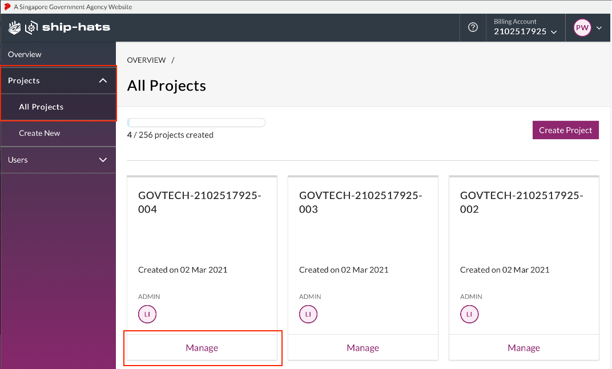
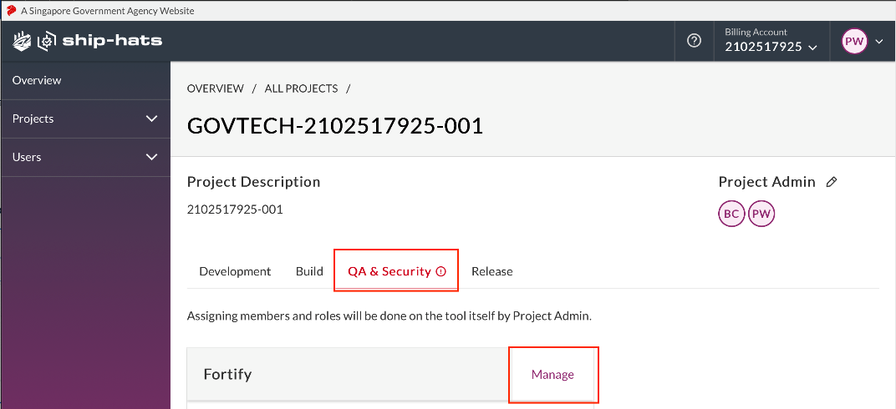
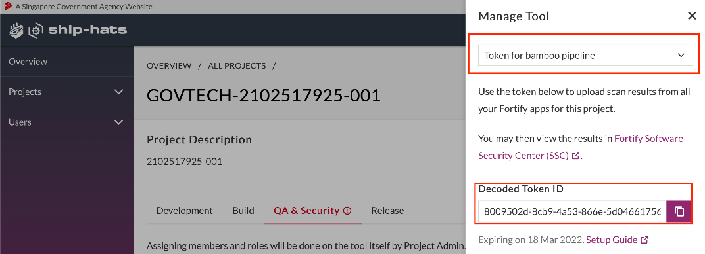
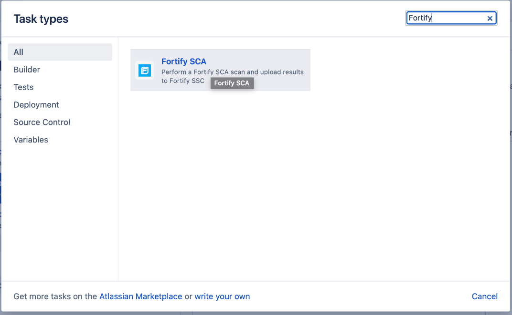
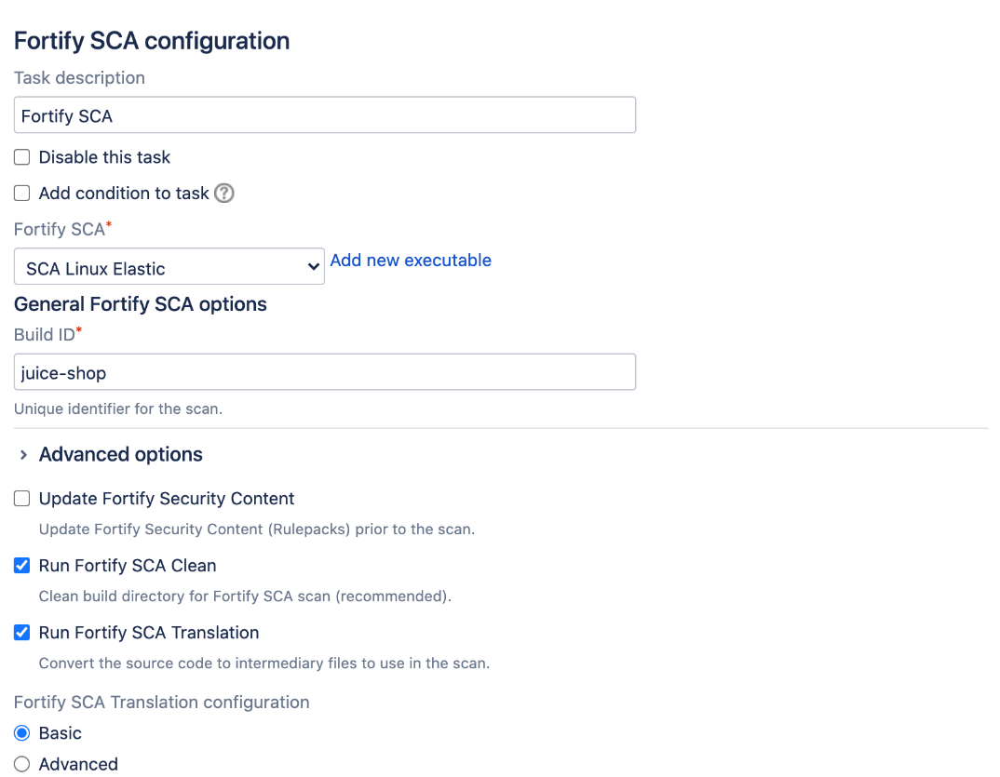
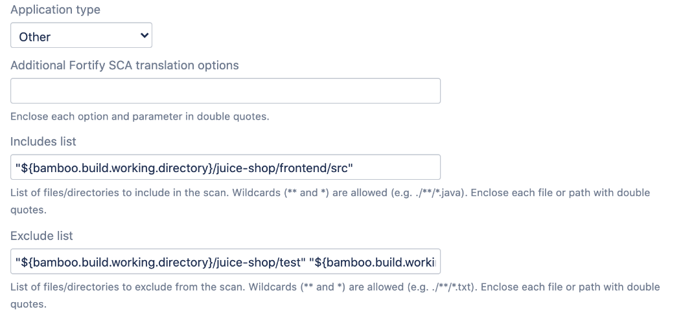
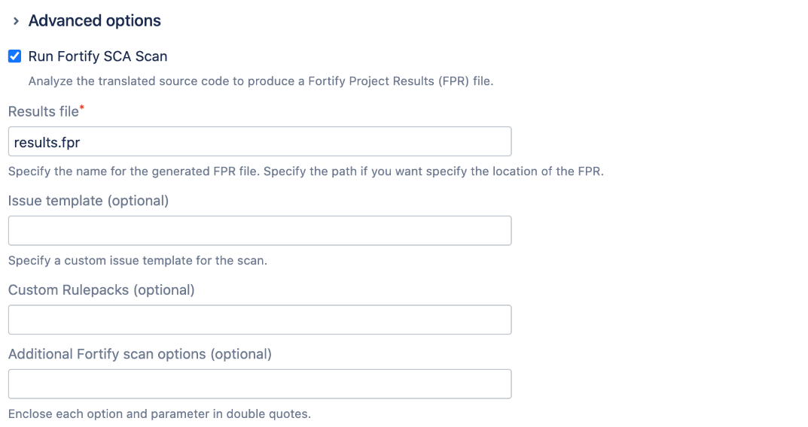
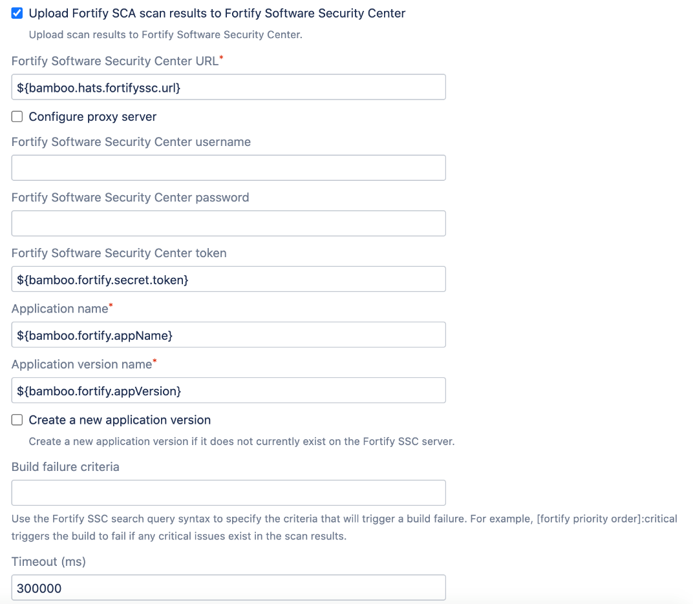

# Set up Bamboo Plan

**Topics**
- [Retrive Decoded Token](#retrieve-decoded-token)
- [Bamboo Setup for Fortify Scan using Fortify SCA Plugin](#bamboo-setup-for-fortify-scan-using-fortify-sca-plugin)
- [Helper Scripts](#helper-scripts)
- [Bamboo Specs with Fortify Plugin](#bamboo-specs-with-fortify-plugin)
- [Report Generation](#report-generation)
- [Additional Resources](#additional-resources)

## Retrieve Decoded Token

### Prerequisites
The user must be at least a Project Admin (PA) in order to retrieve the decoded token from the SHIP HATS Self Help Portal.

### To retrieve decoded token via SHIP HATS Self Help Portal
When you create a new Fortify project, a service account is created for your projects to use. You can visit the [SHIP-HATS portal](https://www.ship.gov.sg) to retrieve the decoded token. If you are using this approach, you do not need to include username for the Fortify scan.

For more details, refer to the [Get token for Fortify application](https://docs.developer.tech.gov.sg/docs/ship-hats-documentation/#/manage-fortify-applications?id=get-token-for-fortify-application) section in the SHIP-HATS Portal guide. 
<!--
1.	If you have created the Fortify App, proceed to step 5. 
If you have not created the Fortify App, go to the [SHIP-HATS](https://www.ship.gov.sg) portal, and then log in with your SHIP credentials.
1.	In the left side bar, click **Projects** > **All Projects** > **Manage** on any project shown on the main screen.

    

1.	Click **QA & Security**, and then click **Manage** in the **Fortify** section.

    

1.	Click the drop down list on the right side, and select **Token for Bamboo pipeline**

    

1.	Copy the value from **Decoded Token ID** and save it.
-->

## Bamboo Setup for Fortify Scan using Fortify SCA Plugin
>**Note:** This setup only includes running a Fortify scan; not report generation. 

### To create Fortify SCA:

1. Click **Add Task**, and then select **Fortify SCA**.

    

1.	In the **Fortify SCA configuration** window, enter the following details:
    -   For **Task description** and **Build ID**, add a value of your choice. It will not impact the results of the Fortify scan.
    - Under **Fortify SCA** drop-down:
        - If you are using a Linux agent, select *SCA Linux Elastic* 
        - If you are using a Windows agent, select *SCA Fortify Dotnet*
    - Select the **Run Fortify SCA Clean** and **Run Fortify SCA Translation** check boxes.  
             

        
 
1.	Enter the following details:
    - In **Application type**, select the lanuguage that you use. If the language you use does not belong in the list, select *Other*.
    - For **Additional Fortify SCA translation options**, refer to https://www.microfocus.com/documentation/fortify-static-code-analyzer-and-tools/2020/SCA_Guide_20.2.0.pdf for more information.
    - For **Includes list** and **Excludes list**, you can specify which directory within the code repository you want to include and exclude from the scan.  
     
    
    

1.	Check the **Run Fortify SCA Scan** check box, and then specify a name for the generated FPR file in the **Results.file** field.

    
 
1.	Select the **Upload Fortify SCA scan results to Fortify Software Security Center** to automatically upload the scan results to [Fortify SSC](https://ssc.hats.stack.gov.sg/), and then enter details for the following parameters:

    

    >**Note:** Make sure that you append *bamboo* in all your variables. For example, your variable is ${fortify.password}, you must reference it in Bamboo as ${bamboo.fortify.password}.

    - **Fortify Software Security Center URL:**  You can use the same value as shown in the guide
    - **Fortify Software Security Center token:** Add in the environment variable containing the decoded value of the token under the Retrieval of Decoded Token step
    - **Application name:** Add your Fortify application name as shown in Fortify SSC (refer to image below)
    - **Application version name:** Enter your Fortify application version name as shown in Fortify SSC (refer to image below)

        

1.	Click **Save** and you are ready to run your Fortify scan.

1. Assign values from your environment variables under **Default Plan Configuration** > **Variables** as shown below:  

    

1. Under **Default Job**, make sure that your Fortify job has the following required capability to use the correct HATS image to build your Fortify job:
        - For Linux builds, use *hats_linux_image exists*
        - For Windows builds, use *hats_windows_image exist*

            

## Helper Scripts
If your team prefers to use scripts (Script Task), you can reference to the helper script by CTMO. It includes an established flow of running the Fortify scan.
- https://bitbucket.ship.gov.sg/projects/CLGLAB/repos/cicd-helper-scripts/browse/bash/microfocus_fortify

## Bamboo Specs with Fortify Plugin
Bamboo does not support Fortify plugin being executed in Bamboo Specs. This may be due to some underlying configurations in Fortify plugin that does not allow Bamboo Specs to reconstruct the Fortify plugin back to its intended original state.
- Use Script Task to run `sourceanalyzer` command to run the Fortify scan for your project.
- Use the helpers scripts by CTMO or use them as reference on how to use Fortify SCA, `sourceanalyzer` command.

## Report Generation
Refer to the [Generate PDF Report](fortify-generate-pdf) topic in the documentation.

## Additional Resources

- Full Plugin docs: https://www.microfocus.com/documentation/fortify-plugin-for-bamboo/
- Fortify Static Code Analyzer (SCA): https://www.microfocus.com/documentation/fortify-static-code/