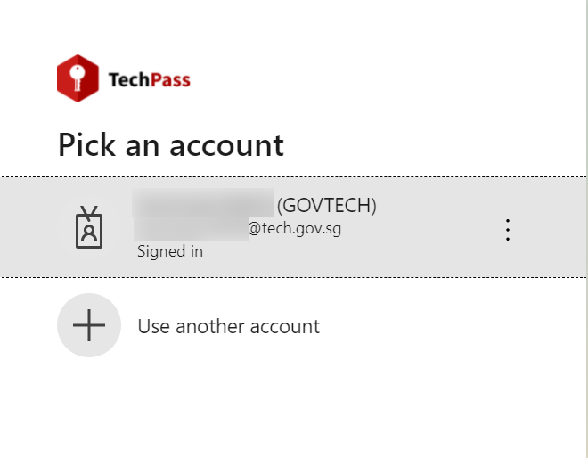
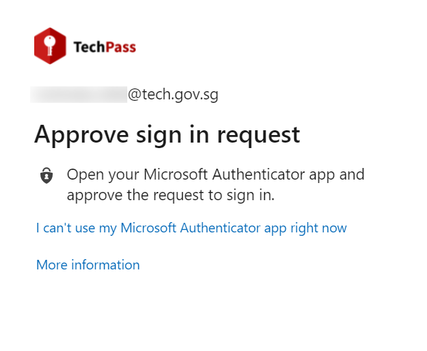

# General FAQ

## [General User FAQ](#general-user-faq)

  
1. What is a named user?
 
A named user refers to licenses that is bound to a specific user. Each named user uses a licence in the subscription quota.

 

  
2. Are admin accounts such as Subscription Admin (SA) and Service Accounts considered as a named user account? 
 
Yes. Subscription Admin (SA) and Service Accounts are considered as a named user account.

 

  
3. Do Subscription Admin(SA) accounts consume quota? 
 
No. Subscription Admin (SA) accounts do not consume quota.

 

  
4. How do I reset my password?
 
You can find the steps to <a href="https://docs.developer.tech.gov.sg/docs/ship-hats-documentation/#/portal-guide/manage-account?id=reset-password">reset password</a> as described in <a href"=https://docs.developer.tech.gov.sg/docs/ship-hats-documentation/#/portal-guide/manage-account">manage accounts</a> in SHIP-HATS Portal Admin guide

 

  
5. How do I reset my 2FA?
 
You can find the steps to <a href="https://docs.developer.tech.gov.sg/docs/ship-hats-documentation/#/portal-guide/manage-account?id=reset-2fa">reset 2FA</a> as described in <a href="https://docs.developer.tech.gov.sg/docs/ship-hats-documentation/#/portal-guide/manage-account">manage accounts in SHIP-HATS Portal Admin guide</a>.

 

  
6. What if I have lost my mobile device?
 
You can refer to <a href="https://docs.developer.tech.gov.sg/docs/ship-hats-documentation/#/portal-guide/manage-account"> manage accounts</a> for more information on instructions to reset your account.

 

  
7. Can I access SHIP-HATS tools via GSIB device?
 
Yes. You can access SHIP-HATS tools such as Confluence, Jira, Bamboo, Nexus Repo, Nexus IQ and SHIP-HATS Service Desk via GSIB.

  
*To access SHIP-HATS tools on GSIB :*
  1. Go to the SHIP-HATS tools you intend to use. ie. <a href="http://confluence.ship.gov.sg"> Confluence</a>
  2. You will be directed to **TechPass**
  
  
  
  3. Sign in and approve via the **Microsoft Authenticator** app
 
  
  
  4. You can sign in with your **SHIP-HATS** id or with TechPass.

## [Basic Support FAQs](#basic-support-faq)

  
1. What is basic support? 
 
Basic support is the support provided by SHIP-HATS team as per on the service agreement.

 

  
 2. How do I submit my requests for any support required? 
 
Email enquiries_enp@ship.gov.sg or you can submit a ticket on the <a href="https://jira.ship.gov.sg/servicedesk/customer/portal/11">SHIP service desk (SSD) portal</a>.

 

  
3. What are the operating hours for basic support? 
 
SHIP-HATS basic support to all users is offered from Monday to Friday, 9.00 AM to 5.30 PM.
Agencies can subscribe to the extended support hours as an add-on if required.

 

  
4. What are the operating hours for extended support? 
 
SHIP-HATS extended support is offered from Monday to Friday, 9.00 AM to 10.00 PM.

 

  
5. Is the basic support free? 
 
Yes, it is free with any subscription tier.

 

  
6. What are the rates for extended support? 
 
Extended support is charged at 50% of the total subscription based on the standard price.
  

 

  
7. Can I subscribe to Extended Support for a limited time? 
 
Yes. A one-month advance notice is required. There is no pro-rated price and is computed as a full-month's rate. Hence, to maximise it is recommended to start on the 1st of any month.

 

  
8. How do I subscribe to extended support? 
 
Email enquiries_enp@tech.gov.sg to subscribe to extended support.

 

  
9. How do I cancel extended support? 
 
Email enquiries_enp@tech.gov.sg to cancel extended support.

 

  
10. Can I view the history of my support requests? 
 
Users can refer to their requests on the <a href="https://jira.ship.gov.sg/servicedesk/customer/portal/11">SSD portal</a>.

## [TechPass FAQs](#techpass-faq)

  
1. What is TechPass? 
 
TechPass is a Single Sign- On, Identity Access Management solution for developer services in Singapore Government Technology Stack (not only enabling users to access and transition seamlessly between services but also improving downstream user experiences). With their TechPass ID, users can seamlessly access  Singapore Government Tech Stack (SGTS) developer services by signing in once. For more details, refer to <a href="https://www.developer.tech.gov.sg/singapore-government-tech-stack/service-management/techpass.html"> TechPass overview.</a> 

 

  
 2. Can I choose not to migrate to TechPass enablement?  
 
TechPass will be the  default user identity to access Singapore Government Tech Stack (SGTS) services simplifying your login experience. We strongly recommend activating your TechPass account. However, if you have any strong business reasons, please drop us an email at <a href="mailto:enquiries_ship@tech.gov.sg?subject=SHIP-HATS%20Enquiry:"> SHIP-HATS Support</a>.

 

  
3. When will my SHIP-HATS account be enabled for TechPass login?  
 
TechPass for SHIP-HATS accounts is being rolled out in phases. You will receive an invitation email once your account is activated. Our objective is to activate TechPass accounts for all SHIP-HATS users by Q2 FY22. 

 

  
 4. How do I ensure that I have successfully onboarded TechPass for my SHIP-HATS login? 
 
On GMD device: login to TechPass and access the <a href="http://www.ship.gov.sg/">SHIP-HATS portal</a>. You have successfully onboarded if you are able to access the <a href="http://www.ship.gov.sg/">SHIP-HATS portal</a>. 
On GSIB devices: login to TechPass and access any of the SHIP-HATS tools. You have successfully onboarded if you are able to access them. For more details, read <a href="https://confluence.ship.gov.sg/display/SHIP/SHIP+TechPass+Enablement+-+User+Guide">Use TechPass to log in to SHIP-HATS and integrated services</a>.

 

  
5. What happens to my current LDAP account once I onboard to TechPass?  
 
For existing users, your LDAP accounts will be deleted. There will not be any impact on existing user permissions on each SHIP-HATS tool. 
  New users onboarding to SHIP-HATS will be given a TechPass account upon successful onboard. 

 

  
 6. What is the benefit of enabling TechPass for my SHIP-HATS account? 
 
You can use TechPass to access SHIP-HATS services seamlessly on GSIB and GMD devices without logging in to individual tools and in the future have a single sign on for all SGTS products.

 

