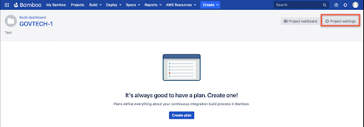
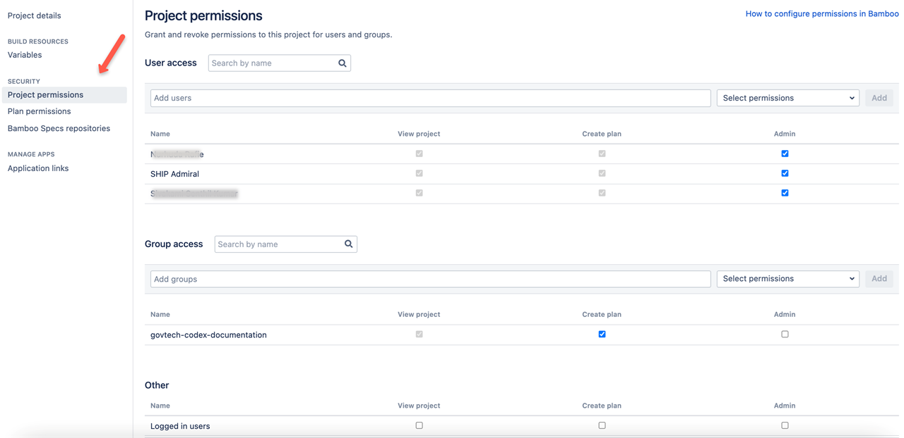

# Atlassian Bamboo – Roles and Permissions

You can use Bamboo for continuous integration. It allows developers to automatically build, integrate, test the source code and prepare for deployment. <a href="https://docs.developer.gov.sg/docs/ship-hats/#/user-roles-permisions">SHIP-HATS Project Admin (PA)</a> can add Atlassian Bamboo to a SHIP-HATS project. 
 
### Bamboo user roles and permissions
Once you add Bamboo as your project tool, a Bamboo project is created. Please refer to <a href="https://confluence.atlassian.com/bamboo/bamboo-permissions-369296034.html"> Bamboo project permissions </a> to know more about the possible permissions for users added to the project. 

### SHIP-HATS - Bamboo role mapping

| SHIP-HATS | Bamboo |
| :-------- | ------ |
| Project Admin | Administrator for the project.  This role is assigned by default when Bamboo is added to the SHIP-HATS project. Administrator can assign project roles to other users and there can be more than one Administrator. |
| Users | SHIP-HATS users can be assigned as an administrator or added as user to the project. |

### Bamboo Users
You can add and manage users as individual users and group. Administrator can view **Project permissions** assigned for users and groups.

*To view project permissions:*
1. In <a href="https://bamboo.ship.gov.sg/">SHIP Bamboo</a>, go to **Projects** and choose your project. 

1. Click  **Project settings**. Note that if you do not have Admin permissions, you will not be able to view this option.

1. From the sidebar, select **Project permissions**. You will be able to view the **Project permissions**.

### Bamboo User access
Administrator can add users individually and manage their permissions.

###Bamboo Group access 
Groups are an easier and efficient way to manage user access for multiple users. 
Users can raise a <a href="https://jira.ship.gov.sg/servicedesk/customer/portal/11/">service request</a> with the required group name, project name and user details such as name and email address. Crowd administrator in the SHIP-HATS team evaluates the request and approves it accordingly.  

If approved, the group is created with the agency name prefixed to it. For example, *govtech-codex-documentation*. If a group was already created for managing users in any one of the Atlassian products added to your project on SHIP-HATS, you would be able to see that in all the integrated Atlassian products. Bamboo project administrators can manage user groups for this project.

### Additional Resources
Please refer to <a href="https://confluence.atlassian.com/bamboo/bamboo-permissions-369296034.html"> Bamboo project permissions </a> to know more about the possible permissions for the users added to a project.
