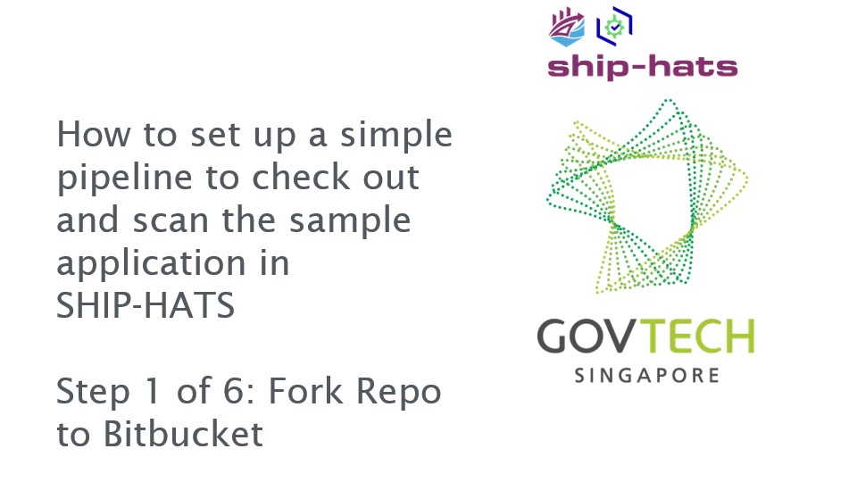
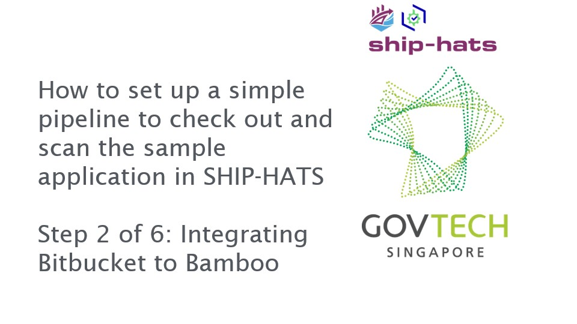
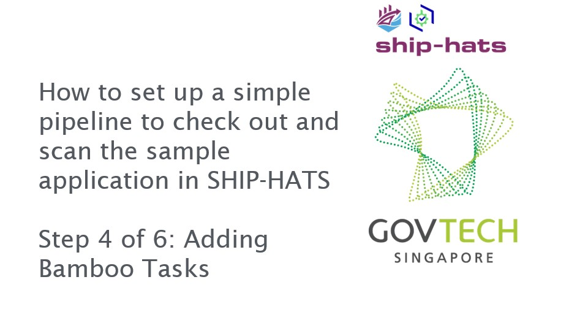
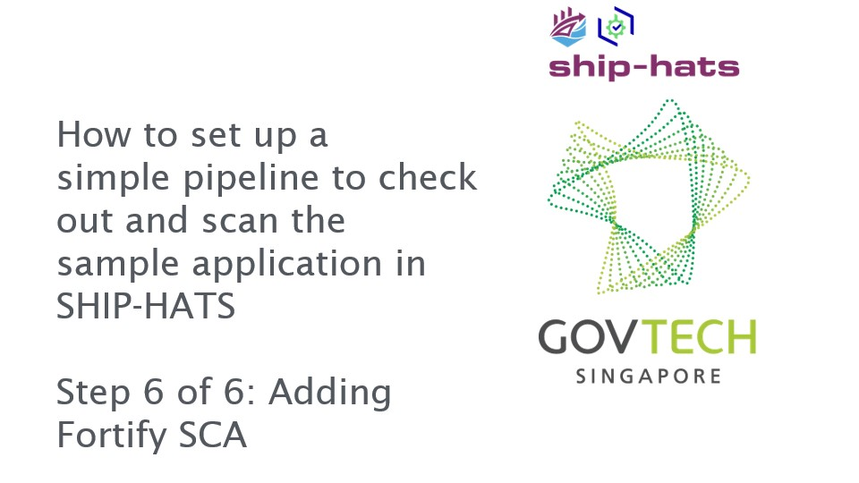

# How to set up a simple pipeline to check out and scan the sample application
This tutorial is to guide you in setting up a simple pipeline using Javascript to check out and scan the sample application in SHIP-HATS.

## What is a Continuous Integration?
Continuous Integration(CI) is a software engineering approach where developers merge the code into a shared code repository and then verified by automated build and testing.

## Prerequisites
1. You must have Bitbucket, Bamboo, Nexus IQ and Nexus Repository added to your project.  If not, please contact your Project Admin to get the required access.

2. You must have “write access” to the projects created on the above-mentioned tools. If not, please contact your Project Admin to get the required access.

3. You must have a basic understanding of the SHIP-HATS CI Tools (Bitbucket, Bamboo, Nexus IQ and Nexus Repository)

For more information on prerequisites, kindly refer to:  
<a href="https://docs.developer.gov.sg/docs/ship-hats-documentation/#/user-roles-permissions">General Information on user roles and permissions</a> 
<a href="https://docs.developer.gov.sg/docs/ship-hats-documentation/#/get-started/bitbucket-user-role">Bitbucket user roles and permissions</a> 
<a href="https://docs.developer.gov.sg/docs/ship-hats-documentation/#/get-started/bamboo-user-roles">Bamboo user roles and permissions</a> 

User Permissions information on Fortify, Nexus IQ and Nexus Repository Manager will be updated soon!

## Setting up a simple pipeline to check out and scan the sample application in SHIP-HATS

### Step 1 of 6: Fork Repo to Bitbucket
Bitbucket is a source code management tool. Source code for your application is hosted within a Bitbucket repository. A Bitbucket project contains one or more repositories.  

Normally, an application development team will create an empty repository and check in their code. For this tutorial, we will make use of existing code. We will create a new repository by forking from another repository. 

Click on the image to view the video.

### Step 2 of 6: Integrating Bitbucket to Bamboo
As your code repo is in Bitbucket, we need to integrate it into Bamboo to allow and automate testing of the code/application. Bamboo is essentially a build tool that allows constant merging, testing of code  which allows  development teams to receive rapid feedback on their work.

Click on the image to view the video.

### Step 3 of 6: Adding a Bamboo Trigger
Adding a Bamboo Trigger is required so that Bamboo is notified whenever there is a code change in any of the selected source code repositories. 

Click on the image to view the video.

### Step 4 of 6: Adding Bamboo Tasks
Adding Bamboo tasks allows the automated execution of code, steps and processes.

Click on the image to view the video.

### Step 5 of 6: Adding Nexus IQ
Adding Nexus IQ as a Bamboo task allows the execution of vulnerability scanning for dependencies and libraries.

Click on the image to view the video.

### Step 6 of 6: Adding Fortify SCA
Adding Fortify SCA as a Bamboo task allows the execution of vulnerability scanning for your source code.

Click on the image to view the video.

?> As this is a sample pipeline, do reset user access and unlink the repository after completion of the tutorial
