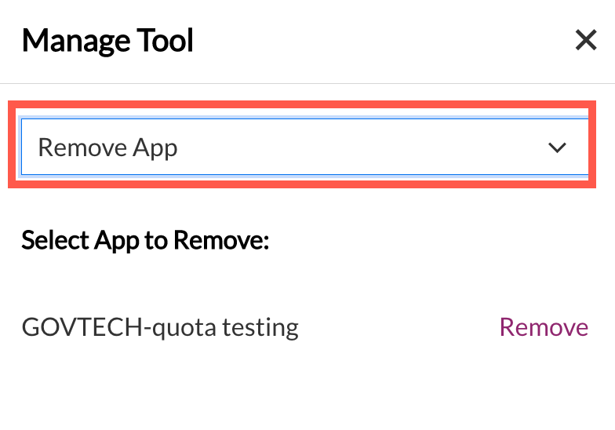

# Manage Projects

This section explains how a Subscription Admin creates SHIP-HATS projects and how Project Admin manages these projects by adding the required users and tools.

- [Create new projects](#create-new-projects)
- [Add project admins](#add-project-admins)
- [View projects](#view-projects)
- [Add project tools](#add-project-tools)
- [Create Project tool with customised project key](#creation-of-project-tool-with-customised-project-key)
- [Manage user groups within a Project tool](#manage-user-groups-within-a-project-tool)
- [Manage users within a Project Tool](#manage-users-within-a-project-tool)
- [Remove projects](#remove-projects)
- [Remove project tools](#remove-project-tools)

## Create new projects

Subscription Admin (SA) can create new projects in SHIP-HATS and manage them. SAs assign Project Admins (PA). Both SA and PA can manage the projects by adding project tools and add users.

### To create a new project

1. From the side menu, click **Projects** > **Create New**.  

>**Tip:** Alternatively, if you are viewing **All Projects**, click **Create Project**.  

<kbd></kbd>

2. Provide information in the following fields:

    |Field|Description|
    |---|---|
    | **Project Name** |Specify name of the project. 
    |**Project Description**| Specify details of the project. 
    |**Project Admin 1**| Select Project Admin from the drop-down list. If *First Name* and *Last Name* were not provided when creating a new user account, email address will appear in the drop-down list.
    |**Project Admin 2**| This is an optional field. Select a second Project Admin from the drop-down list. If *First Name* and *Last Name* were not provided when creating a new user account, email address will appear in the drop-down list. 
3. Click **Create Project**. The created project details are displayed as shown below.

    <kbd></kbd>

SA or PA can add tools and additional PAs. 
> **Note:** The number of PAs each project is entitled to is based on the [subscription tier](https://www.developer.tech.gov.sg/products/categories/devops/ship-hats/subscription) quota for which the agency has subscribed.

## Add project admins

Subscription Admins can add Project Admins using the SHIP-HATS portal. When creating a project in an account, it is mandatory to specify at least one Project Admin. SAs can add any additional PAs anytime in the future.  

> **Note:** The number of PAs each project is entitled to is based on the [subscription tier](https://www.developer.tech.gov.sg/products/categories/devops/ship-hats/subscription) quota for which the agency has subscribed.

### To add a project admin

1. From the side menu, click **Projects** > **All Projects** to view all the projects in this subscription account. If needed, refer to [Switching account](https://docs.developer.gov.sg/docs/ship-hats-documentation/#/manage-account?id=switch-account).
2. Locate the project, and then click **Manage**.

    <kbd></kbd>

3. Click the edit icon.  
    The **Manage Admin** panel appears.

    <kbd></kbd>

4. Click **Add another** to select the required user from the drop-down list.

    <kbd></kbd>

    >**Note:** If *First Name* and *Last Name* were not provided when creating a new user account, email address will appear in the drop-down list.
5. Click **Add** to add this user as a project admin. Once successfully added, an email notification will be sent to the requesting SA with copy sent to the other SA and the newly added PA.

>**Note:** To know how to remove a Project Admin, refer to **Remove User**.

## View projects

SA and PAs of a subscription account can view all the projects of the subscription account.

### To view a project in a subscription account

1. From the side menu, click **Projects** > **All Projects**.

    Tile view of all the projects in this subscription account is displayed. If needed, refer to [Switching account](https://docs.developer.gov.sg/docs/ship-hats-documentation/#/manage-account?id=switch-account).

    <kbd></kbd>

2. Click **Manage** to view tools that are currently added to the project.

## Add project tools

SA or PA can add the required project tools as explained below. You can add tools for **Development**, **Build**, **QA &amp; Security**, and **Release** phases as per the tools quota allotted for your subscription type. 

### To add project tools

1. From the side menu, click **Projects** > **All Projects** to view all the projects in this subscription account. If needed, refer to [Switching account](https://docs.developer.gov.sg/docs/ship-hats-documentation/#/manage-account?id=switch-account).
2. Locate the project to which you want to add a tool, and then click **Manage**.

3. Go to the required tab, and then click **Add tool**. Follow the steps in table for the tool that you want to add. 

    |Tab|Available Tools|Steps|
    |---|---|---|
    |Development|Jira|<ol><li>Click the **Select Tool** drop-down list, and select **Jira**.</li><ol>|
    |Development|Confluence|<ol><li>Click the **Select Tool** drop-down list, and select **Confluence**.</li><ol>|
    |Development|Bitbucket|<ol><li>Click the **Select Tool** drop-down list, and select **Bitbucket**.</li><ol>
    |Build|Bamboo|<ol><li>Click the **Select Tool** drop-down list, and select **Bamboo**.</li><ol>
    |Build|Nexus IQ|<ol><li>Click the **Select Tool** drop-down list.</li><li> Provide values in the **App Name** and **App ID** fields.</li><ol>|
    |Build|Nexus Repo|<ol><li>Submit a [service request](https://jira.ship.gov.sg/servicedesk/customer/portal/11/) to add this tool.</li><ol>|
    |QA &amp; Security|pCloudy Device Farm & HATS Browser Farm|<ol><li>Click the **Select Tool** drop-down list, and select **pCloudy Device Farm & HATS Browser Farm**.</li><ol>|
    |QA &amp; Security|SonarQube - Community Edition|Make sure that you have logged in to [SonarQube](https://sonar.hats.stack.gov.sg/sonar) at least once.<ol><li>Click the **Select Tool** drop-down list.</li><li> Provide values in the **App Name** and **App ID** fields.</li><ol>|
    |QA &amp; Security|SonarQube - Developer Edition|Make sure that you have logged in to [SonarQube](https://sonar1.hats.stack.gov.sg/sonar) at least once.<ol><li>Click the **Select Tool** drop-down list.</li><li> Provide values in the **App Name** and **App ID** fields.</li><ol>|
    |QA &amp; Security|Fortify SCA & WebInspect|<ol><li>Click the **Select Tool** drop-down list.</li><li> Provide values in the **App Name** field.</li><ol>|
    |QA &amp; Security|Container Image Scanner|<ol><li>Click the **Select Tool** drop-down list.</li><li> Provide values in the **Scanner Type** and **App Name** fields.</li><ol>|
    |Release|NA|<ol><li>Submit a [service request](https://jira.ship.gov.sg/servicedesk/customer/portal/11/) to add the tools.</li><ol>.|
    
    >**Note:** After you reach the quota, the respective tool name(s) will be disabled in the **Select Tool** drop-down list. If you still want to add these tools, send an email to enquiries_ENP@tech.gov.sg.    
1. Click **Add**.   
    
    The selected project tool and application is added.
    

## Creation of Project tool with customised project key
Subscription Admin (SA) and Project Admin (PA) can customise the project keys when adding app tools on SHIP-HATS. This is currently applicable for Jira, Bitbucket, and Confluence.  

### To customise project key

1. Go to **Projects> All Projects>** > Manage > to view and select the relevant project. 
2. Click Add tool under **Development** tab.
3. Choose the required tool.

    

4.  Select **Customise Project Key**.

    

5. Enter the required project key. It can only have 2-10 characters, consisting of uppercase letters A-Z and numbers from0-9. First character must be an alphabet. 

    

<!--CODEX-49288 https://gdsjira.ship.gov.sg/browse/PORTAL-2133 -->

## Manage user groups within a project tool

As a Subscription Admin or a Project Admin, you can manage following within a project tool or app:  
- User groups
- Permissions or Roles  

You can manage user groups and permissions/roles for the following tools:
- Nexus IQ
- SonarQube

### To manage user groups for your project tool or app

1. Go to **Projects** > **All Projects**.

    <kbd></kbd>

1. Navigate to your project, and then click **Manage** on the project tool for which you want to manage/add user groups. 

1. In the **Manage Tool** window that appears, from the dropdown, select **Manage/add user group**. 
    - **SonarQube:** Provide values in the **App Name** and **User Group** fields, and then select the required permissions. The **Browse** permission is selected by default along with any other permission.

        <kbd>
    - **Nexus IQ:** Provide value in the **User Group** field, and then select the required roles.
        
        <kbd></kbd> 
1. Click **Update**.
    The permissions or roles are updated in the portal as well as respective tools. Any permissions assigned via portal will override the previously assigned permissions in NexusIQ at the app level.

## Manage Users within a Project Tool

As a Subscription Admin or a Project Admin, you can manage users within a project tool or app. You can manage users for the following tools:
- Bamboo
- Bitbucket
- Confluence
- JIRA
- Nexus IQ

### To manage users for your project tool or app

1. Go to **Projects** > **All Projects**.

    <kbd></kbd>

1. Navigate to your project, and then select **Manage**.

1. Go to the required tab, and then click **Manage** on the project tool whose users you want to manage. The **Manage Tool** window appears. 
    
    Follow the steps in table for the tool that you want to add.

    |Tab|Available Tools|Steps|
    |---|---|---|
    |Development|Jira|<ol><li>Click the **Manage/add user** drop-down list, and follow the on-screen instructions.</li><ol>|
    |Development|Confluence|<ol><li>Click the **Manage/add user** drop-down list, and follow the on-screen instructions.</li><ol>|
    |Development|Bitbucket|<ol><li>Click the **Manage/add user** drop-down list, and follow the on-screen instructions.</li><ol>
    |Build|Bamboo|<ol><li>Click the **Manage/add user** drop-down list, and follow the on-screen instructions.</li><ol>
    |Build|Nexus IQ|<ol><li>Click the **Manage/add user** drop-down list.</li><li>Select the **User** drop-down list, and select a user.</li><li>Select the role that you want to assign to the user.</li><li>Click **Update**.</li><ol>|
    |QA &amp; Security|SonarQube|<ol><li>Click the **Manage/add user** drop-down list, and follow the on-screen instructions.</li><ol>|

    >**Note:** For the Atlassian apps (Bamboo, Bitbucket, Confluence, and JIRA), in the **Manage Tool** window, the link to tool or app server, includes the project key that you selected. This enables you to get to the project in the tool or app server directly. 
    >
    ><kbd></kbd>

## Remove user groups from a project tool

As a Subscription Admin or a Project Admin, you can remove permissions and roles within a project tool or app for the following tools:
- Nexus IQ
- SonarQube

### To remove user groups for your project tool or app

1. Go to **Projects** > **All Projects**.

    <kbd></kbd>

1. Navigate to your project, and then click **Manage** on the project tool for which you want to manage/add user groups. 
1. In the **Manage Tool** window that appears, from the dropdown, select **Manage/add user group**. 
1. In the **App Name** and **User Group** fields, select the App and user group for which you want to update permissions or roles.  
1. Next to the permissions or roles that you want to remove, clear the check box, and then click **Update**. 
The permissions or roles are updated.

## Remove projects

As a Subscription Admin, you can remove a project as long as no tool has been added to it.

### To remove a project

1. From the side menu, click **Projects** > **All Projects** to view all the projects in this subscription account. If needed, refer to [Switching account](https://docs.developer.gov.sg/docs/ship-hats-documentation/#/manage-account?id=switch-account).
1. Locate the project, and then click **Manage**. You will see  beside the project name as shown below.

    <kbd></kbd>
1. Click the three dots, and then choose **Remove project**.

## Remove project tools
As a Subscription Admin or a Project Admin, you can remove a tool or an app when it is not required. You can remove the following tools: 
- Confluence
- Bitbucket
- Fortify SCA & WebInspect
- Jira
- Nexus IQ
- SonarQube

### To remove a project tool
1. Go to **Projects** > **All Projects**.
1. Navigate to the project whose tool you want to remove, and then click **Manage**.
1. On the tool that want to remove, click **Manage**.  
    The **Manage Tool** window appears.
1. From the dropdown, select **Remove App**. 
    **Select App to Remove:** appears, displaying a list of apps. 

    

1. Next to the app that want to remove, click **Remove**.  
    The **Remove** window appears.

    
1. Enter the requested information, and then click **Proceed**.  

    
    The selected app is removed. If this the last app for the tool, the project tool is also removed. 