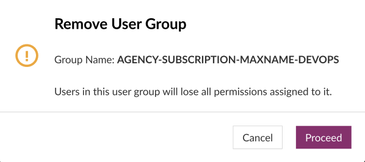
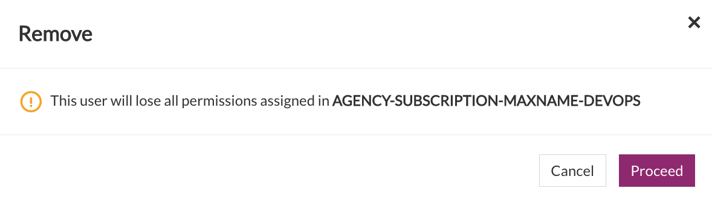

# Manage User Groups

Using the user groups, you can:
- Group multiple users together
- Assign tool's permissions to a group
- Assign same permissions to all users in a group

**Topics**

- [Create User Groups](#create-user-groups)
- [Access User Groups](#access-user-groups)
- [Add users to user groups](#add-users-to-user-groups)
- [Modify User Groups](#modify-user-groups)
- [Remove User Groups](#remove-user-groups)
- [Remove users from user groups](#remove-users-from-user-groups)

## Create User Groups

You can create upto 200 user groups. 

### To create a user group
1. From the side menu, click **Users** > **All User Groups**. 
1. Click **Create Group**.
   The **Create New User Group** window appears.
1. Enter values in the following fields:     
   |Field|Description|
   |---|---|
   **Group Name**|Enter name for the group|
   |**Group Description**|Enter description for the group|
   **Group Members**|Select usres to be added to the group from the drop-down list. Only active users will be visible in list|

   <kbd></kbd>

1. Click **Create Group**.  
   The user group is created and appears under the **Group Name** column in the **All User Groups** window. 

   <kbd></kbd>

## Access User Groups

### To access a user group
1. From the side menu, click **Users** > **All User Groups**.  

   The **All User Groups** window appears, displaying all the user groups listed under the **Group Name** column.  

   <kbd></kbd>

## Add users to user groups

### To add users to user groups

1. From the side menu, click **Users** > **All User Groups**.
1. Next to the user group to which you want to add a new user, under **Actions**, select **Manage**.   
1. In **Add users**, select additional users, and then click **Add**. 
   The newly added user appears under the **Name** column.

   <kbd></kbd>

---

1. Add users to groups
1. on respective tool's user mgmt page, assign permissions to the group.
1. once assigned, all users in groups will have same permissions.

## Modify User Groups

### To modify a user group

Under **Actions**, select **Manage**.

## Remove User Groups

### To remove a user group
1. From the side menu, click **Users** > **All User Groups**.
1. Next to the user group to which you want to add a new user, under **Actions**, select **Remove group**.  
   A pop-up message appears indicating that the users in this user group will lose all permissions assigned to it.  

   <kbd></kbd>
1. Click **Proceed**.  
   The user group is removed. 

## Remove Users from User Groups

### To remove a user from a user group
1. From the side menu, click **Users** > **All User Groups**.
1. Next to the user group to which you want to add a new user, under **Actions**, select **Manage**.
1. Under the **Name** column, next to the user that you want to remove, click **Remove**.  
A pop-up appears indicating that the selected user will lose all the permissions assigned to the user group.  

   <kbd></kbd>
1. Click **Proceed**.  
   The user is removed.
