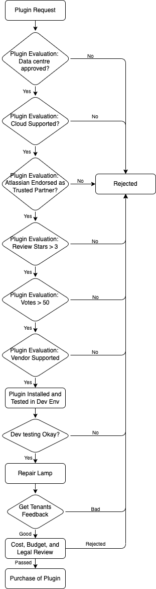

# Plugin Review Process

>**Important:** This document is provided for information only. The information contained herein is subject to change and the plugins can be rejected at ship’s own discretion

## Minimum requirement for a plugin request

Following are the minimum requirements for a plugin request:
- Data center approved
- *Cloud Supported
- Atlassian endorsed as Trusted Partners
  - *Cloud Fortified
  - *Cloud Security Participant
- Plugin Ratings:
  - Stars > 3
  - Votes > 50
- Vendor Supported

*Not applicable to Bamboo

## Plugin Review Process

Following diagram shows the plugin review process:

