# Account Management

SHIP-HATS users may have user roles such as Subscription Admin, Project Admin or User. Only an agency user can be a Subscription Admin for an account. Subscription Admin can also be a Project Admin. This section explains the following:

- [Log In as Subscription Admin or Project Admin](#log-in-as-subscription-admin-or-project-admin)
- [Log In as Users](#log-in-as-users)
- [View Dashboard](#view-dashboard)
- [Switch account](#switch-account)
- [View Plan Details](#view-plan-details)
- [View Billing Info](#view-billing-info)
- [View and Update Profile](#view-and-update-profile)
  - [View and Update Profile as Subscription Admin and Project Admin](#view-and-update-profile-as-sa-and-pa)
  - [View and Update Profile as User](#view-and-update-profile-as-user)
- [Change Password](#change-password)

## [Log In as Subscription Admin or Project Admin](#log-in-as-subscription-admin-or-project-admin)

This section explains how to log in to SHIP-HATS as Subscription Admin (SA) or Project Admin (PA) using a device that has an active OpenVPN connection.

If you have not yet setup OpenVPN, refer to How to setup OpenVPN connection.

*To log in to SHIP-HATS portal as SA or PA*:

1. Go to **[SHIP-HATS portal](https://www.ship.gov.sg/)**.
2. Click **Log In**.

<kbd>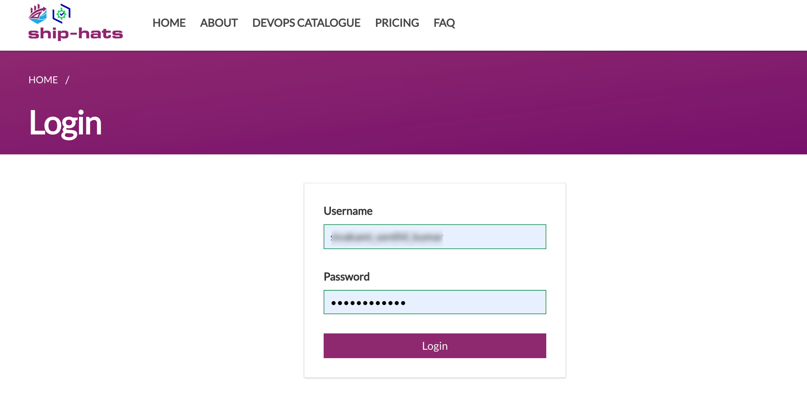</kbd>

3. Enter your SHIP-HATS **Username** , **Password** and click **Log In**. You will be directed to the **Overview** of your subscription account and it is the [Dashboard View](#view-dashboard) of your account.

Note that if you are SA or PA for more than one account and when you log in, by default, you will be viewing the subscription details of the first account to which you were added as SA or PA. Refer to [Switch account](#switch-account) to know about switching between accounts.

## [Log In as Users](#log-in-as-users)

If you are a SHIP-HATS user who is not a SA or PA, upon logging in, you will be directed to the SHIP-HATS **Profile** page as shown below.

*To log in to SHIP-HATS as user who is not SA or PA*:

Follow steps 1-3 as mentioned in [Log In as Subscription Admin or Project Admin](#log-in-as-subscription-admin-or-project-admin). You will be directed to your **profile**.

<kbd>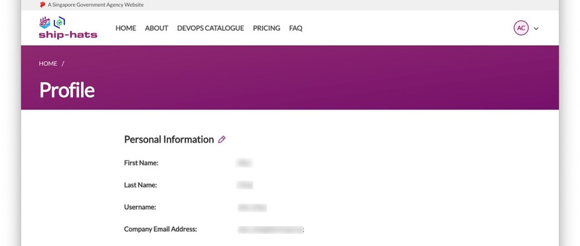</kbd>

## [View Dashboard](#view-dashboard)

The **Overview** page of the subscription account is the dashboard view of the subscription account. Subscription Admin (SA) and Project Admin (PA) can view the following details from this page.

- Subscription tier for the Billing Account
- [Plan details](#view-plan-details)
- Count of projects hosted on this account
- Count of users added to this account
- Projects using shared Bamboo agents and their usage quota.

Note: The term **Overview** and **Dashboard view** may be used interchangeably.

<kbd>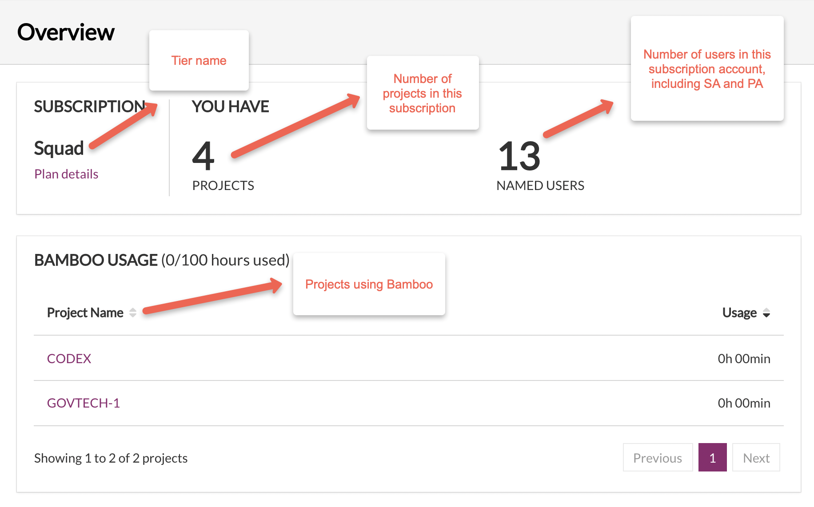</kbd>

## [Switch account](#switch-account)

If you are a SA or PA for more than one subscription account in SHIP-HATS, you may need to switch between these accounts to **Manage users**, **Manage Projects**, [**View Plan Details**](#view-plan-details) and [**View Billing Info**](#view-billing-info).

*To switch account*:

1. From the [**Overview**](#view-dashboard) page, mouse hover **Billing Account** at the top right and choose **Switch account**.

<kbd>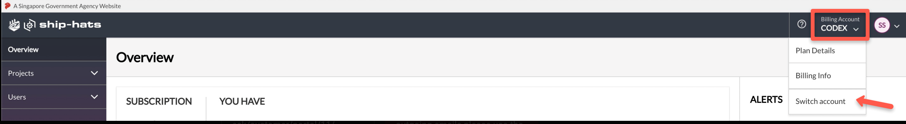</kbd>

2. Choose the required billing account.

<kbd>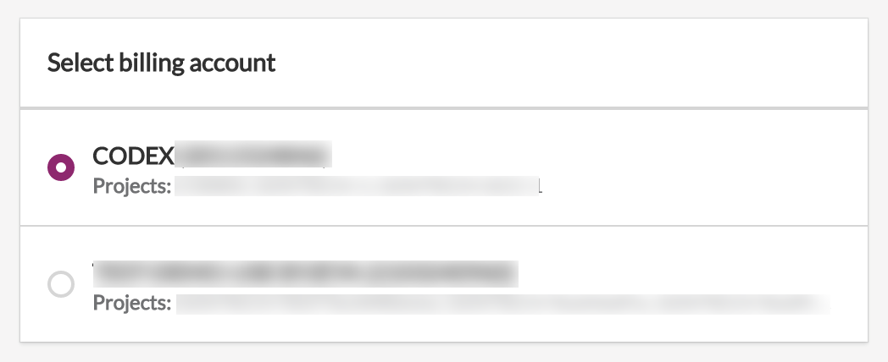</kbd>

[Overview](#view-dashboard) of the selected subscription is displayed.

## [View Plan Details](#view-plan-details)

SA and PA can view the plan details of their subscription account(s) from the dashboard view.

*To view plan details of a subscription*:

1. Ensure you are in the required account. If needed, refer to [Switch account](#switch-account).

<kbd>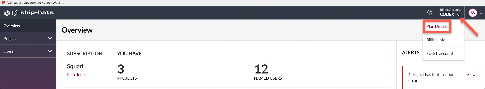</kbd>

3. From the [**Overview**](#view-dashboard) page, mouse hover **Billing Account** at the top right and choose **Plan Details**.

<kbd>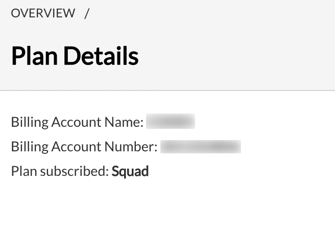</kbd>

Alternatively, click **Plan details** from **Overview** as shown below.

Note that SHIP-HATS users other than SA and PA can view their associated subscription account&#39;s details such as Billing Account Name and Billing Account Number in their Profile page as shown below. Refer to View and Update Profile as User for additional information.

<kbd>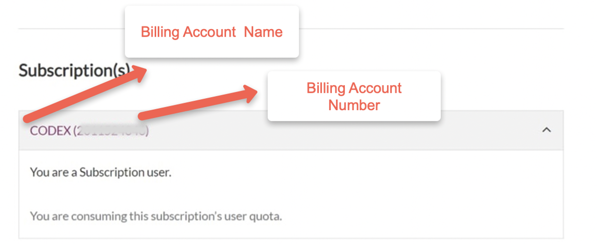</kbd>

## [View Billing Info](#view-billing-info)

If you are a Subscription Admin, you will be able to view and edit the billing information of their subscription account(s).

*To view and edit billing information*:

1. Ensure you are in the required account. If needed, refer to [Switch account](#switch-account).
2. From the [**Overview**](#view-dashboard) page, mouse hover **Billing Account** at the top right and choose **Billing Info**.

<kbd>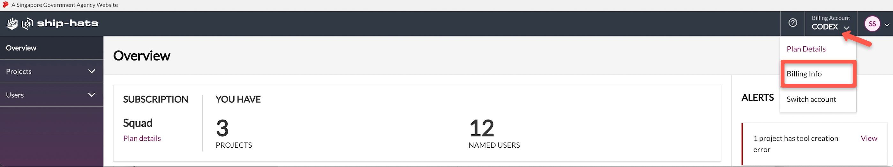</kbd>

This page has three sections: Billing Information, Approver Information and Signed Service Sheets (SS).

**Billing Information**

<kbd>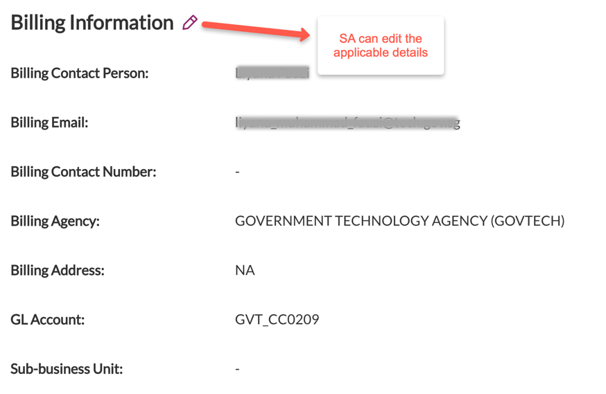</kbd>

SA can edit all the details in this section except **Billing Agency**. Note that GL Account is applicable for Govtech agencies and Sub-Business Unit is applicable for non-Govtech agencies.

**Approver Information**

You can find the approver details for this account.

<kbd>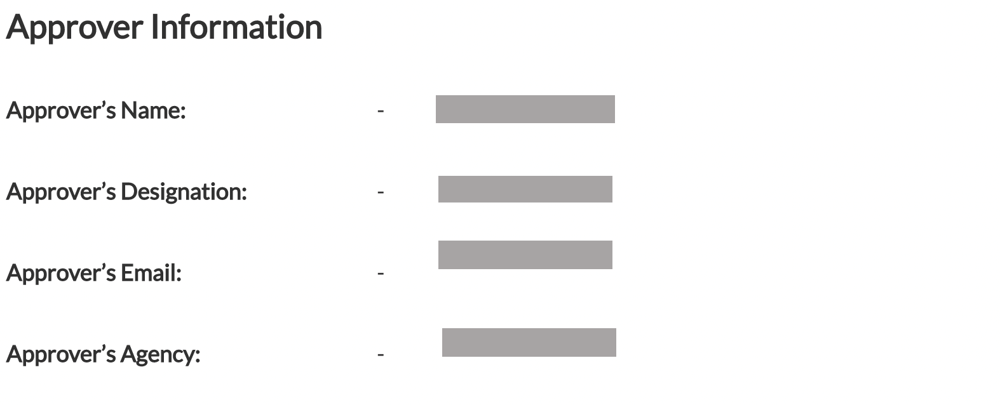</kbd>

**Signed Service Sheets (SS)**

You can find the signed service sheets for this account.

<kbd>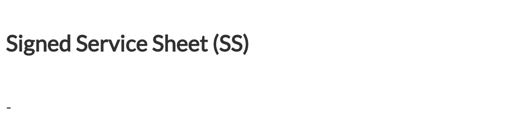</kbd>

## [View and Update Profile](#view-and-update-profile)

SHIP-HATS users can view and update their profile any time using the [SHIP-HATS portal](https://www.ship.gov.sg/).

### [View and Update profile as SA and PA](#view-and-update-profile-as-sa-and-pa)

SA and PA can update the profile from the **Overview** page.

*To view and update profile as SA and PA*:

1. From the [**Overview**](#view-dashboard) page, mouse hover your profile avatar at the top right. Your user name and user role for this account are displayed. In the below example, the logged in user is a **Subscription Admin** for this account.

<kbd>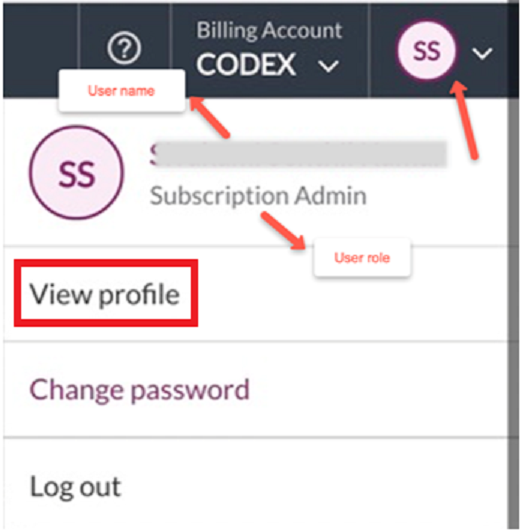</kbd>

2. Choose **View Profile**.

Your personal information and details of accounts in which you are SA and PA are listed.

3. To update your **Personal Information**, click the edit icon.

<kbd>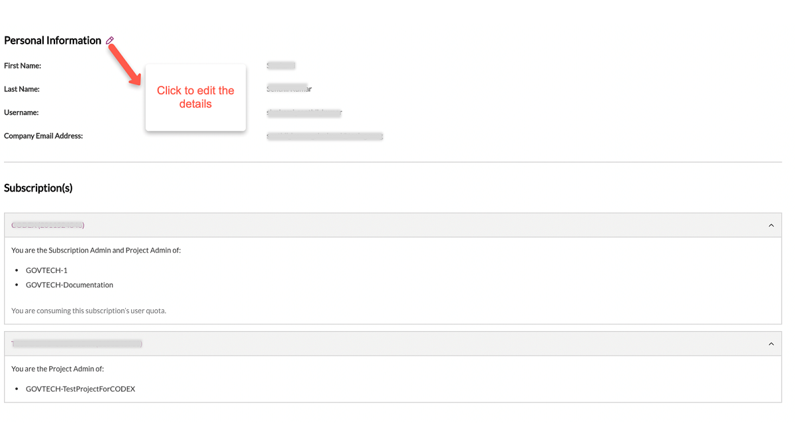</kbd>

### [View and Update Profile as User](#view-and-update-profile-as-user)

When users other than SA or PA log in to [SHIP-HATS portal](https://www.ship.gov.sg/), they are directed to their profile page. Click the edit icon to update your details.

<kbd>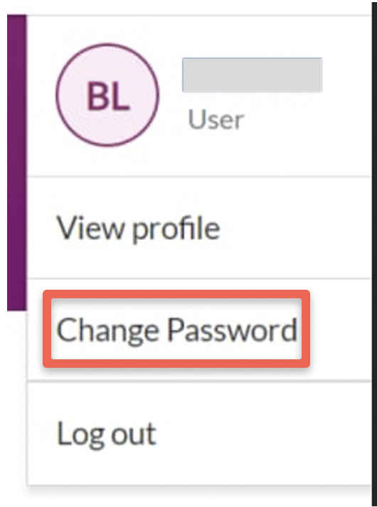</kbd>

Alternatively, mouse hover your avatar at the top-right. To view and update user profile, click **View Profile**.

## [Change Password](#change-password)

As per IM8 policy, all SHIP-HATS users must change their SHIP-HATS password at least once every 12 months. Users can change the password using the SHIP-HATS portal.

*To change password*:

1. Mouse hover your avatar at the top-right.
2. Choose **Change Password.**

<kbd></kbd>

The **Change Password** page is displayed.

<kbd>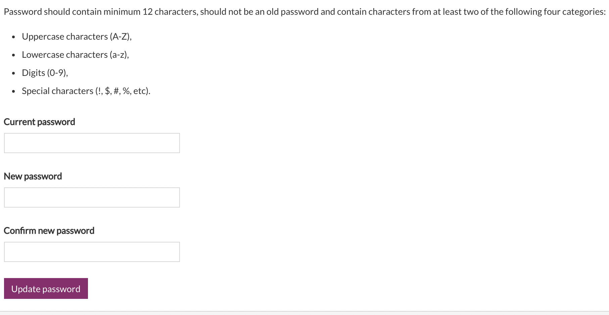</kbd>

3. Enter **Current password**.
4. Enter **New Password** , **Confirm new password** and click **Update password**.
