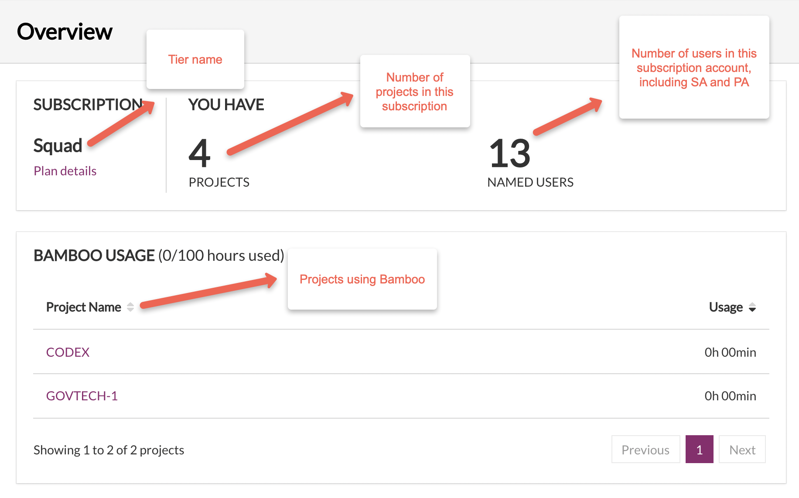

# Logging In and Logging Out 

**Prerequisites**: 

- Before you start, you must have been invited and onboarded to SHIP-HATS. 
- Once you have successfully onboarded, make sure that you have setup your OpenVPN connection. 

Once the above are successfully completed, you can proceed to log in to SHIP-HATS. Logging in tells the system who you are and what permissions you have in SHIP-HATS. For example, if you are a Subscription Admin or Project Admin, you can view the SHIP-HATS [**Dashboard** view](#viewing-dashboard) once you log in. Other “Users” will be directed to their [**Profile**](#viewing-profile-as-users) page.

*To log in to SHIP-HATS:*

1. Go to [SHIP-HATS portal](https://www.ship.gov.sg/).
2. Click **Log In**.

<kbd></kbd>

3. Enter your **Username** ,**Password** and click **Log In**.

## [Viewing Dashboard](#viewing-dashboard)
The **Overview** page of the subscription account gives the dashboard view of the subscription account. Only Subscription Admin (SA) and Project Admin (PA) can access this dashboard to view the following details.

- Subscription tier for the Billing Account
- [Plan details](https://docs.developer.gov.sg/docs/ship-hats-documentation/#/portal-guide/account-management/account-management?id=viewing-plan-details)
- Count of projects hosted on this account
- Count of users added to this account
- Projects using shared Bamboo agents and their usage quota.

?> Note: The term **Overview** and **Dashboard view** may be used interchangeably.

<kbd></kbd>

## [Viewing Profile as Users](#viewing-profile-as-users)
When users other than SA or PA log in to [SHIP-HATS portal](https://www.ship.gov.sg/), they are directed to their **Profile** page. You may view the details of the subsvription account under which your SHIP-HATS usage is currently billed.

<kbd></kbd>

