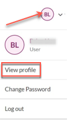

# Manage Account

SHIP-HATS users may have user roles such as Subscription Admin (SA), Project Admin(PA) or User. Only an agency user can be a Subscription Admin for an account. Subscription Admin can also be a Project Admin. This section explains the following:

- [Log in and Log out](#log-in-and-log-out)
- [Log in using TechPass](#log-in-techpass)
- [View dashboard](#view-dashboard)
- [View user profile](#view-user-profile)
- [Switch account](#switch-account)
- [Update admin profile](#update-admin-profile)
- [Update user profile](#update-user-profile)
- [Change password](#change-password)
- [Retrieve username](#retrieve-username)
- [Reset password](#reset-password)
- [Reset 2FA](#reset-2fa)
- [View plan details](#view-plan-details)
- [View billing information](#view-billing-information)

## [Log in and Log out](#log-in-and-log-out)

**Prerequisites**:

- Before you start, you must have been invited and onboarded to SHIP-HATS.
- Once you have successfully onboarded, make sure that you have setup your OpenVPN connection.

### Log in

Once the above are successfully completed, you can proceed to log in to SHIP-HATS. Logging in tells the system who you are and what permissions you have in SHIP-HATS. For example, if you are a Subscription Admin or Project Admin, you can view the SHIP-HATS [**Dashboard**](#view-dashboardview-dashboard) view once you log in. Other “Users” will be directed to their [**Profile**](#view-user-profileview-user-profile) page.

**Note:**

- If you are an SA or PA for a subscription account, when you log in, by default, you will be viewing the subscription details of the first account to which you were added as SA or PA.

- SA and PA must have logged in to SonarQube at least once before proceeding to create applications in SonarQube. Though only SA and PA can create applications in SonarQube, we recommend all users to log in to SonarQube at least once to ease the process if a user role is changed to a PA role in the future. Refer to [SHIP-HATS integrated tools version](https://docs.developer.gov.sg/docs/ship-hats-documentation/#/get-started/ship-hats-integrated-tools-version) for SonarQube's URL.

Refer to [**Switch Account**](#switch-account) to know how to switch between different subscription accounts.

*To log in to SHIP-HATS:*

1. Go to [SHIP-HATS portal](https://www.ship.gov.sg/).
2. Click **Log In**.

<kbd></kbd>

3. Enter your **Username** ,**Password** and click **Log In**.

### Log out
When you are done with your activities on the portal, you can log out as shown below.

*To log out from SHIP-HATS:*

- Hover over your profile icon and click **Log out**.

<kbd></kbd>

If you are inactive for five minutes on the portal, the system prompts you with the following message. Click **Yes, Keep me signed in** to continue your session.

<kbd></kbd>

If you are inactive for 10 minutes on the portal, the system prompts you with the following message.

<kbd></kbd>

## [Log in using TechPass](#log-in-techpass)

*To log in to SHIP-HATS using TechPass:*

1. Go to [SHIP-HATS portal](https://www.ship.gov.sg/).
2. Click **Log In with TechPass**.

<kbd></kbd>

3. Enter your **Enter your TechPass details** and click **Next**.

<kbd></kbd>

4. You will be redirected to the GCC log-in page. Enter your TechPass email address along with the verification code from the Authenticator app and click sign in. 

<kbd></kbd>

5. Read through the **TechPass** Terms of Use and click **Accept**.

<kbd></kbd>

6. Read through the **TechPass MDM** Terms of Use and click **Accept**.

<kbd></kbd>

You have successfully linked your TechPass to SHIP-HATS. You can directly login using TechPass for future access. 

## [View dashboard](#view-dashboard)
The **Overview** page of the subscription account gives the dashboard view of the subscription account. Only Subscription Admin (SA) and Project Admin (PA) can access this dashboard to view the following details.

- Subscription tier for the Billing Account
- [Plan details](#view-plan-detailsview-plan-details)
- Count of projects hosted on this account
- Count of users added to this account
- Projects using shared Bamboo agents and their usage quota.

>**Note:** The term **Overview** and **Dashboard view** may be used interchangeably.

<kbd></kbd>

## [View user profile](#view-user-profile)
When users other than SA or PA log in to [SHIP-HATS portal](https://www.ship.gov.sg/), they are directed to their **Profile** page. You may view more information on your subscription ie. the number of fortify and sonarqube applications tied to the subscription.

<kbd></kbd>

Users can click on the applications to view tokens and the expiry date. The information is also downloadable as CSV

<kbd></kbd>

Users are also able to view the user groups they belong to.

<kbd></kbd>

## [Switch account](#switch-account)
If you are a SA or PA for more than one subscription account in SHIP-HATS, you may need to switch between these accounts to Manage users, Manage Projects, Viewing Plan Details and Viewing Billing Info.

*To switch account:*

1. From the [**Overview**](#viewing-dashboard) page, hover over **Billing Account** at the upper-right area of the page and choose **Switch account**.

<kbd></kbd>

2. Choose the required billing account to view its dashboard.

<kbd></kbd>

## [Update admin profile](#update-admin-profile)
SA and PA can update their profile from the [**Overview**](https://docs.developer.gov.sg/docs/ship-hats-documentation/#/portal-guide/logging-in-and-logging-out?id=viewing-dashboard) page.

*To view and update profile as SA and PA*:

1. From the [**Overview**](https://docs.developer.gov.sg/docs/ship-hats-documentation/#/portal-guide/logging-in-and-logging-out?id=viewing-dashboard) page, hover over your profile icon at the upper-right corner. Your user name and user role for this account are displayed. In the below example, the logged in user is a **Subscription Admin** for this account.

<kbd></kbd>

2. Choose **View Profile**. Your personal information and details of accounts in which you are SA and PA are listed.
3. To update your **Personal Information**, click the edit icon.

<kbd></kbd>

## [Update user profile](#update-user-profile)
When users other than SA or PA log in to [SHIP-HATS portal](https://www.ship.gov.sg/), they are directed to their profile page. To edit user profile page, go to [TechPass Portal](https://portal.techpass.gov.sg/secure/account/profile)

1. Click **edit profile**.

<kbd></kbd>

2. Edit the details as needed and click **Save**. 

<kbd></kbd>

Alternatively, hover over your profile icon at the upper-right corner. To view and update user profile, click **View Profile**.

<!--<kbd></kbd-->

## [Change password](#change-password)
As per IM8 policy, all SHIP-HATS users must change their SHIP-HATS password at least once every 12 months. Users can change the password using the SHIP-HATS portal.

*To change password*:

1. Hover over your profile icon at the upper-right corner.
2. Choose **Change Password.**

<kbd></kbd>

The **Change Password** page is displayed.

<kbd></kbd>

3. Enter **Current password**.
4. Enter **New Password** , **Confirm new password** and click **Update password**.

## [Retrieve username](#retrieve-username)
If you have forgotten your SHIP-HATS username, you may retrieve it anytime following the below steps.

*To retrieve SHIP-HATS username:*

1. Disconnect from your **OpenVPN Connect** client.
2. Go to [SHIP-HATS portal](https://www.ship.gov.sg/).

<kbd></kbd>

3. Click the link indicated in the above image to reset your password. You will be directed to the **Self-help Requests** page.

<kbd></kbd>

4. Click **Retrieve Username**.
5. Enter **Email Address** used for** registering with SHIP-HATS.
6. Select the checkbox to confirm that you are not a robot and click **Submit**.

<kbd></kbd>

## [Reset password](#reset-password)
If you have forgotten your SHIP-HATS password, you may reset it anytime following the below steps.

*To reset SHIP-HATS password:*

1. Disconnect from your **OpenVPN Connect** client.
2. Go to [SHIP-HATS portal](https://www.ship.gov.sg/).

<kbd></kbd>

3. Click the link indicated in the above image to reset your password. You will be directed to the **Self-help Requests** page.

<kbd></kbd>

1. Click **Reset Password**.
2. Enter your **Username** or **Email Address** used for** registering with SHIP-HATS.
3. Select the checkbox to confirm that you are not a robot and click **Submit**.

<kbd></kbd>

An email will be sent with the reset password link to the respective email address.

## [Reset 2FA](#reset-2fa)
You can reset your 2FA for SHIP-HATS anytime by following the below steps.

*To reset 2FA for SHIP-HATS:*

1. Disconnect from your **OpenVPN Connect** client.
2. Go to [SHIP-HATS portal](https://www.ship.gov.sg/).

<kbd></kbd>

3. Click the link indicated in the above image to reset your password. You will be directed to the **Self-help Requests** page.

<kbd></kbd>

4. Click **Reset 2FA**.
5. Enter your **Username** used for** registering with SHIP-HATS.
6. Select the checkbox to confirm that you are not a robot and click **Submit**.

<kbd></kbd>

You will receive a notification stating that your SHIP-HATS 2FA has been reset and with instructions to be followed by you.

## [View plan details](#view-plan-details)

SA and PA can view the plan details of their subscription account(s) from the dashboard view.

*To view plan details of a subscription*:

1. Ensure you are in the required account. If needed, refer to [Switching account](https://docs.developer.gov.sg/docs/ship-hats-documentation/#/portal-guide/logging-in-and-logging-out?id=switch-account).

<kbd></kbd>

2. From the [**Overview**](https://docs.developer.gov.sg/docs/ship-hats-documentation/#/portal-guide/logging-in-and-logging-out?id=viewing-dashboard) page, hover over **Billing Account** at the upper-right area of the page and choose **Plan Details**.

<kbd></kbd>

Alternatively, click **Plan details** from **Overview** as shown below.

?> Note that SHIP-HATS users other than SA and PA can view their associated subscription account's details such as **Billing Account Name** and **Billing Account Number** from their **Profile** page as shown below. Refer to [**View and Update Profile as User**](#viewing-and-updating-profile-as-user) for additional information.

<kbd></kbd>

## [View billing information](#view-billing-information)

If you are a Subscription Admin, you will be able to view and edit the billing information of their subscription account(s).

*To view and edit billing information*:

1. Ensure you are in the required account. If needed, refer to [Switching account](#switch-accountswitch-account).
2. From the [**Overview**](#view-dashboardview-dashboard) page, hover over **Billing Account** at the upper-right area of the page and choose **Billing Info**.

<kbd></kbd>

This page has three sections: Billing Information, Approver Information and Signed Service Sheets (SS).

**Billing Information**

<kbd></kbd>

SA can edit all the details in this section except **Billing Agency**.

?> Note that GL Account is applicable for Govtech agencies and Sub-Business Unit is applicable for non-Govtech agencies.

**Approver Information**

You can find the approver details for this account.

<kbd></kbd>

**Signed Service Sheets(SS)**

You can find the signed service sheets for this account.

<kbd></kbd>
