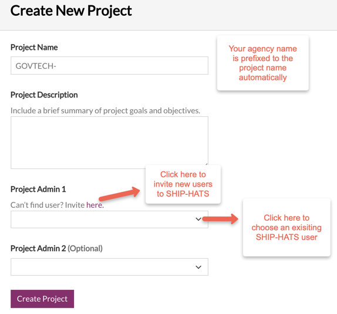
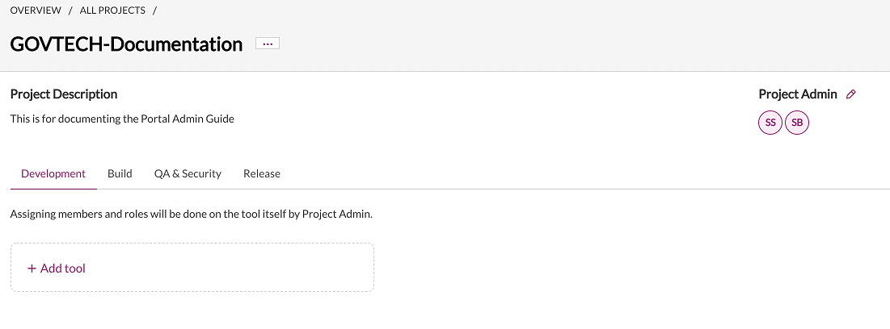
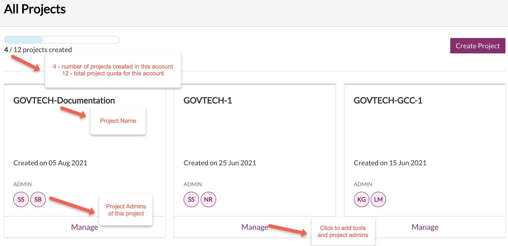
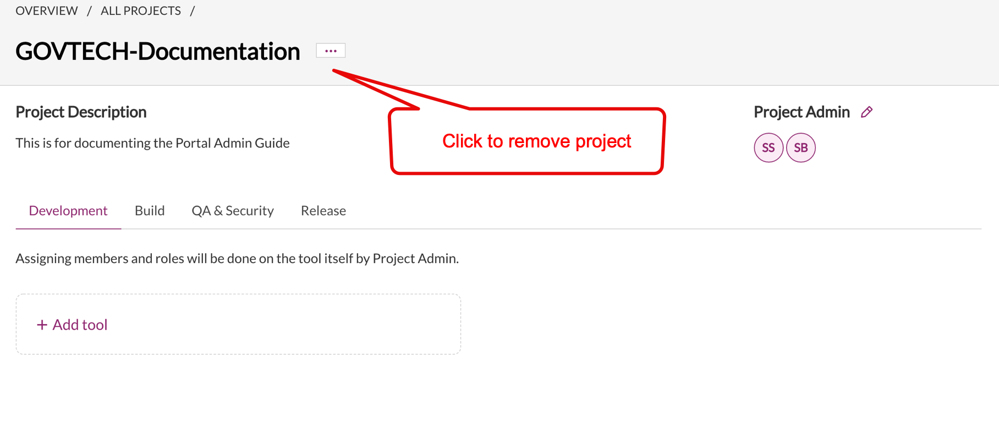
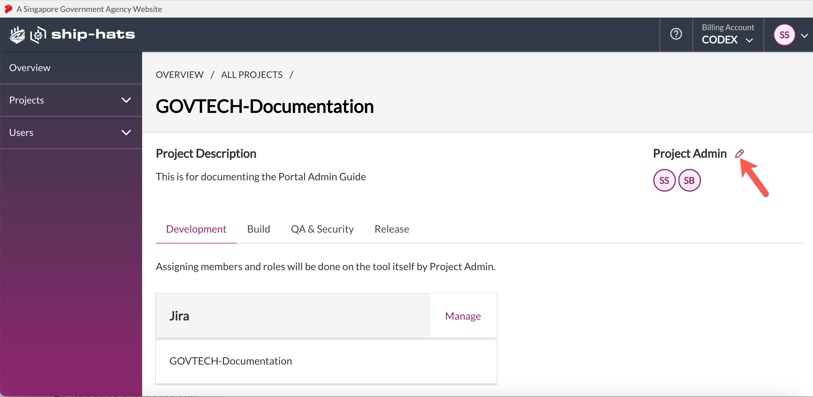
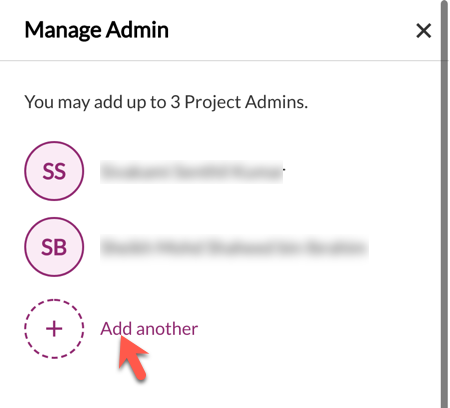
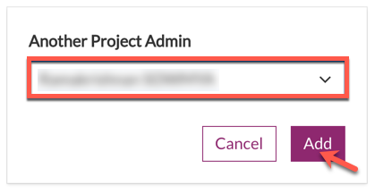
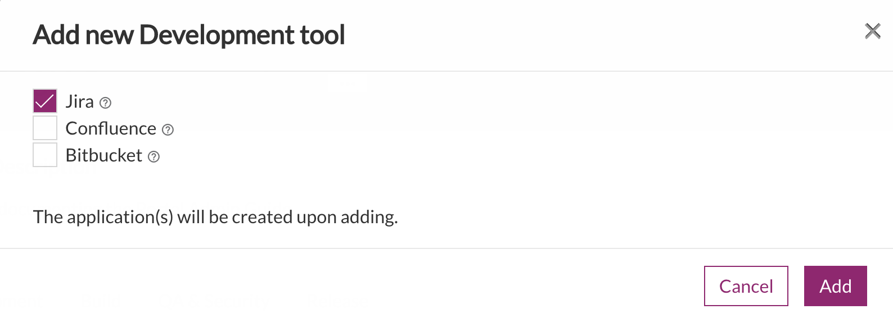
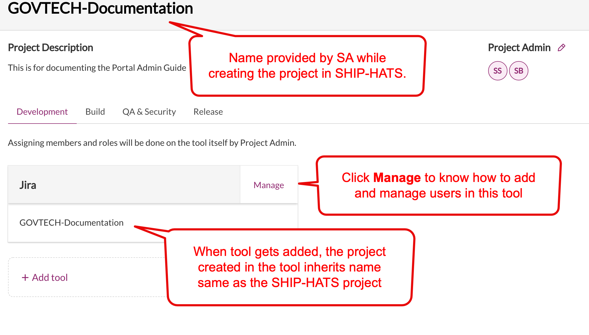
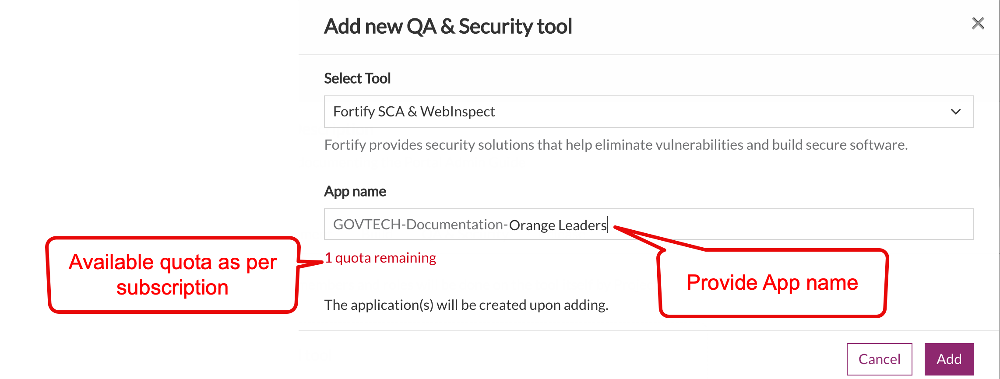

Project Management
This section explains how a Subscription creates SHIP-HATS projects and how the Project Admin can manage these projects by adding the required users and tools.
- [Creating new projects](#creating-new-projects) 
- [Viewing projects](#viewing-projects)
- [Removing projects](#removing-projects)
- [Adding project tools](#adding-project-tools)

## [Creating new projects](#creating-new-projects)

Subscription Admin (SA) can create new projects in SHIP-HATS and manage them. SAs assign Project Admins (PA). Both SA and PA can manage the projects by adding project tools and add users.

*To create a new project*:

1. From the side menu, click **Projects** > **Create New**.

Tip: Alternatively, if you are viewing **All Projects** , click **Create Project**.

<kbd></kbd>

2. Specify **Project Name** , **Project Description** and at least **Project Admin 1**.
3. Click **Create Project**. The created project details are displayed as shown below.

<kbd></kbd>

SA or PA can add tools and additional PAs. Note that SA can add up to three PAs using the SHIP-HATS portal.

## [Viewing projects](#viewing-projects)

SA and PAs of a subscription account can view all the projects of the subscription account.

*To view a project in a subscription account*:

1. From the side menu click **Projects** > **All Projects**.

Tile view of all the projects in this subscription account is displayed. If needed, refer to Switch account

<kbd></kbd>

2. Click **Manage** to view tools that are currently added to the project.

## [Removing projects](#removing-projects)

Subscription Admin can remove a project as long as no tool has been added to it.

*To remove a project*:

1. From the side menu, click **Projects** > **All Projects** to view all the projects in this subscription account. If needed, refer to Switch account.
2. Locate the project and click **Manage**. You will see  beside the project name as shown below.

<kbd></kbd>

3. Click the three dots and then choose **Remove project**.

## [Adding project admins](#adding-project-admins)

Subscription Admins can add up to three Project Admins using the SHIP-HATS portal. While creating a project in an account it is mandatory to specify at least one Project Admin. SAs can add the other two PAs anytime in the future.

*To add a project admin*:

1. From the side menu, click **Projects** > **All Projects** to view all the projects in this subscription account. If needed, refer to Switch account.
2. Locate the project and click **Manage**.

<kbd></kbd>

3. Click the edit icon. **Manage Admin** panel is displayed.

<kbd></kbd>

4. Click **Add another** to select the required user from the drop-down list.

<kbd></kbd>

5. Click **Add** to add this user as a project admin. Once successfully added, an email notification will be sent to the requesting SA with copy sent to the other SA and the newly added PA.

To know how to remove a Project Admin, refer to **Remove User**.

## [Adding project tools](#adding-project-tools)

SA or PA can add the required project tools as explained below. You can add tools for Development, Build, QA &amp; Security and Release phases as per the tools quota allotted for your subscription type. Note that currently you need to raise a [service request](https://jira.ship.gov.sg/servicedesk/customer/portal/11/) for adding the following:

- Build tool - Nexus IQ and Nexus Repo
- Release and Deploy tool- Digital.ai Release and Digital.ai Deploy

*To add project tools*:

1. From the side menu, click **Projects** > **All Projects** to view all the projects in this subscription account. If needed, refer to Switch account.
2. Locate the project and click **Manage**.

<kbd></kbd>

3. Go to the required tab and click **Add tool**.
4. For example, go to **Development** tab and click **Add tool**.

<kbd></kbd>

5. Select the required tool and click **Add**. This tool gets integrated with your SHIP-HATS project and a project is automatically created in the tool with the same name. For example, in this case, the SHIP-HATS project name is _Govtech-Documentation_ and hence the Jira project inherits this name.

<kbd></kbd>

You can add build tools other than Nexus IQ and Nexus Repo in the same manner from the **Build** tab.

Note

- While adding tools such as WebInspect Fortify SCA under the **QA &amp; Security** tab, the system displays the quota remaining for your subscription as shown below.

<kbd></kbd>

- Once you have reached the quota, the respective tool name(s) will be disabled in the **Select Tool** drop-down list. If you still want to add these tools, please do raise a [service request](https://jira.ship.gov.sg/servicedesk/customer/portal/11/).
