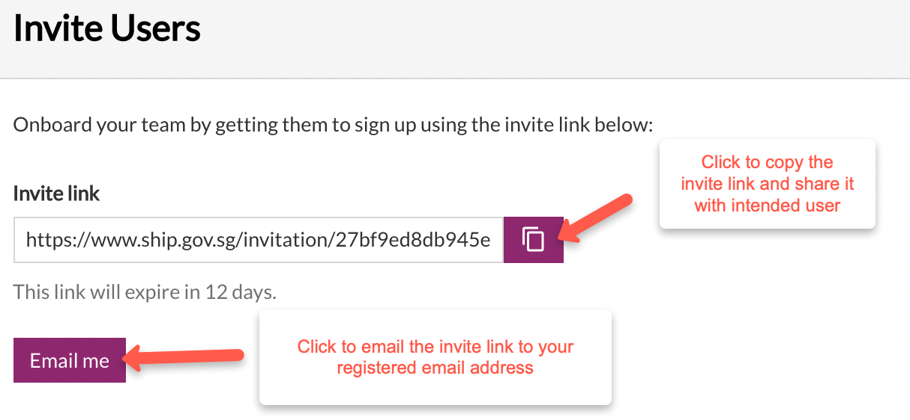
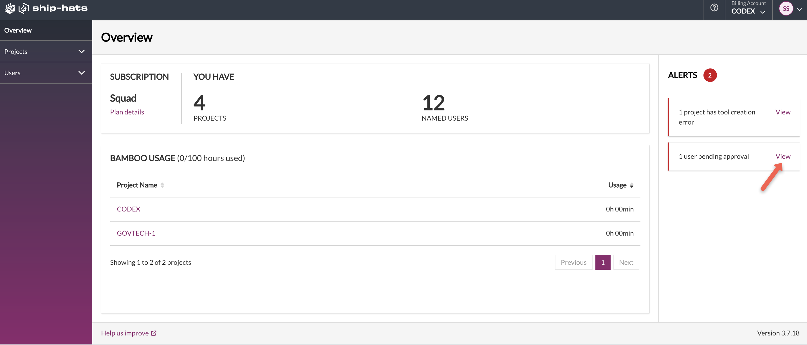
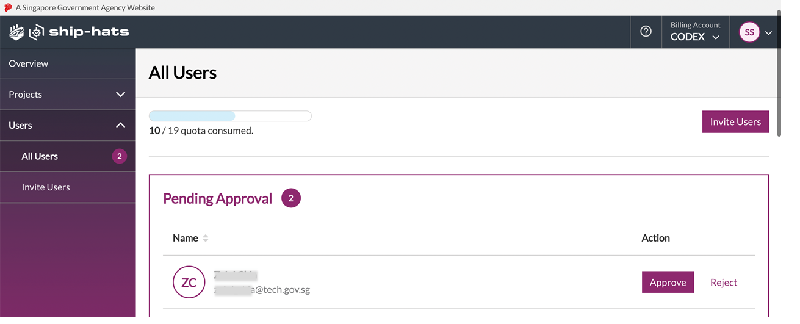
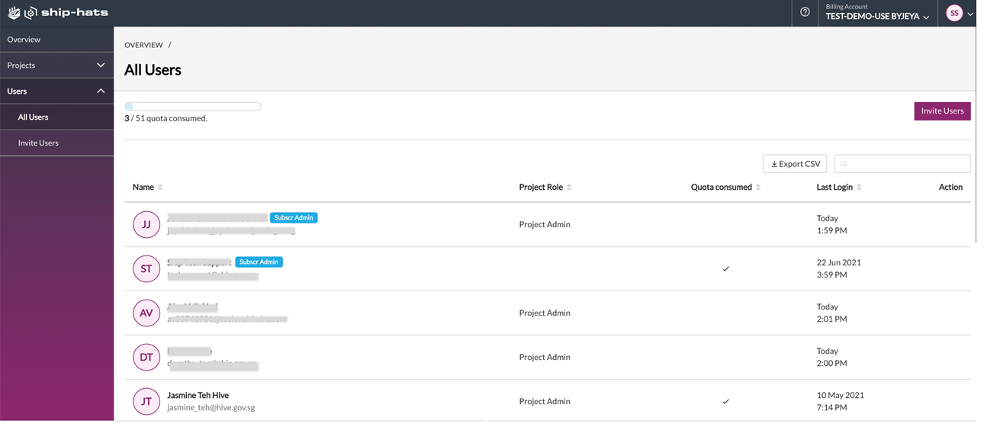
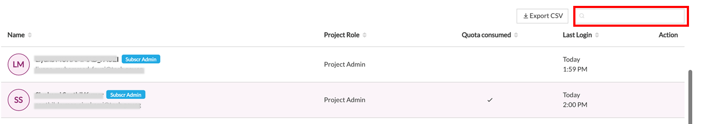
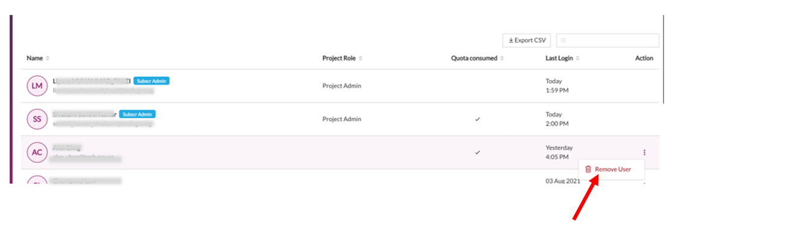
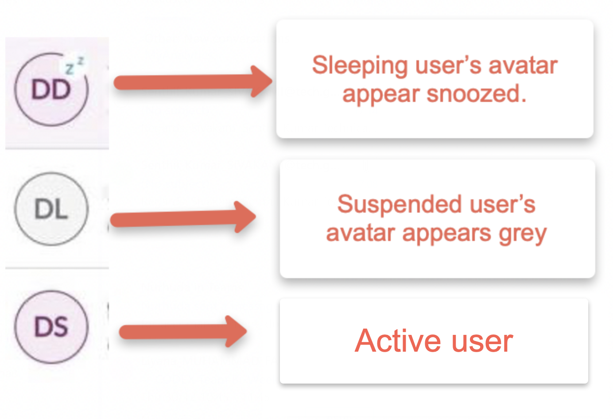
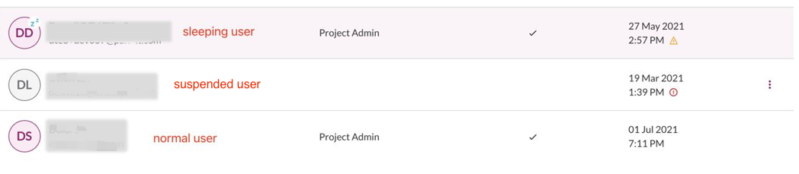

# User Management 
This section describes the following: 

* [Invite Users](#invite-users)
* [Approve New Users](#approve-new-users) 
* [View Users](#view-users)
* [Remove User](remove-user)
* [Reactivate User](reactivate-User) 

## [Invite Users](#invite-users)
Subscription Administrator (SA) and Project Admin (PA) can invite and add users to the subscription. Note that only SA can add a user as PA to their SHIP-HATS projects. 

### To invite users:

1. Log in to <a href="https://www.ship.gov.sg/"> SHIP-HATS portal </a> and ensure you are in the required account. If needed, refer to Switch account. 

2. From the side menu, click **Users > Invite Users**. An invitation link is automatically generated.  
By default, a new invitation link has a 14 days expiry date.  Whenever you invite new users, the same link will be displayed with the remaining expiry date until it expires. In the example below, SA invites a new user to SHIP-HATS. As the invite was created 2 days earlier, the link is valid for the next 12 days. 

3. Click **Email me** to send this link with the expiry date to your SHIP-HATS registered email address and forward it to the intended users so that they can provide required information in the **Invitation Form**. 
Alternatively, click the copy icon to copy and share the invite link with intended users. Note, in this case, make sure to inform the users about the expiry date of this link. 

## [Approve New Users](#approve-new-users) 
Once a user submits the completed SHIP-HATS **Invitation Form**, Subscription Administrator (SA) and Project Admin (PA) will be notified by an email to approve the user registration. 

### To approve new user registration:
1. Log in to <a href="https://www.ship.gov.sg/"> SHIP-HATS portal</a> and ensure you are in the required account. If needed, refer to Switch account. 

If there is a pending user approval task for you, it will be displayed in the **ALERTS** section.  

2. Click **View** corresponding to that alert. You will be directed to the **Pending Approval** section. 

Alternatively, from the side menu, click Users > **All Users**. If there is a pending user approval task, the **Pending Approval** section get displayed. Here, you can view the users that are pending your approval along with their email address.  

Note: If there is a number displayed beside **All Users** menu and **Pending Approval** section, it indicates that many user approvals are pending.  

3. Click **Approve** corresponding to the user. 

4. When prompted to confirm this action, click **Yes**. This user is now approved as SHIP-HATS user under this account. 

Note: Irrespective of agencies, individuals approved as SHIP-HATS users can be added to any SHIP-HATS project and will be billed under the account that initially approved them.  

## [View Users](#view-users)

Subscription Administrator (SA) and Project Admin (PA) can view all users associated with a subscription account and their roles in your account. 

### To view users: 

1. Log in to <a href="https://www.ship.gov.sg/"> SHIP-HATS portal</a> and ensure you are in the required account. If needed, refer to Switch account. 

2. From the side menu, click **Users > All Users**. 

* If a user is a Subscription Administrator, it is indicated by the label Subscr Admin beside the username. 
* If a user has a Project Admin role in one the projects in the subscription account, it will be indicated in the **Project Role** column. 
* You can sort this list in ascending or descending order by anyone of the following: 
  * Name 
  * Project Role
  * Quota Consumed
  * Last Login
* You can quickly search for a user by typing the username in the search box. 

* Click **Export CSV** to download the user list as a .csv file to your local machine. This csv lists the active and removed users along with the approval and removal details.

## [Remove User](#remove-user)

We recommend Subscription Admin (SA) and Project Admin (PA) to periodically review the named users in their account, consumed user quota and remove users who are no longer required. 

Note that SA and PA can remove a user who does not have the Project Admin or Subscription Administrator roles in the subscription account. 

### To remove a user: 

1. Log in to <a href="https://www.ship.gov.sg/"> SHIP-HATS portal</a> and ensure you are in the required account. If needed, refer to Switch account. 
2. From the side menu, click **Users > All Users**. 
3. Search for the user to be removed and from the **Action** column, click  corresponding to the user. 
Tip: Refer to [View Users](#view-users) to know how to search for users and to sort by **Quota Consumed**. 

4. Choose **Remove User**. 

Note, to remove a PA or SA, one of the SA can raise a <a href="https://jira.ship.gov.sg/servicedesk/customer/portal/11/"> service request </a> to change the user role for this individual from PA to normal user. Once this is done, follow the steps mentioned in the **Remove User** section. 

Tip:  While creating this service request, we recommend you tag the user whose role is to be modified and the respective SAs and PAs in the ticket. 

## [Reactivate User](#reactivate-user)

If SHIP-HATS users are inactive for 60 consecutive days, their status changes from **normal user** to **sleeping user**. If the user continues to be inactive, from day 81 onwards an email notification is sent every day to the user until user becomes active (**normal user**) or until it reaches day 90.  

On day 91, if the user is still inactive on SHIP-HATS, user status changes from **sleeping user** to **suspended user**, indicated by a grey avatar.  

SA and PA can reactivate a suspended user back to their account if required. 

### To reactivate user: 

1. Log in to <a href="https://www.ship.gov.sg/"> SHIP-HATS portal</a> and ensure you are in the required account. If needed, refer to Switch account. From the side menu, click **Users > All Users**. 

2. Search for the user to be reactivated and from the **Action** column, click  corresponding to the user. 

Tip: Refer to [View Users](#view-users) to know how to search for users 

3. Choose **Reactivate User**. User, SAs and the requestor will be notified through an email about the reactivation.  

Note:
* Though the reactivated user can log in using the existing credentials, we recommend reactivated users to reset their password. The email sent to the reactivated users will have the link to reset their password. 

* Once a user has been reactivated, an email notification about this reactivation is sent to the requestor and the SAs. 
