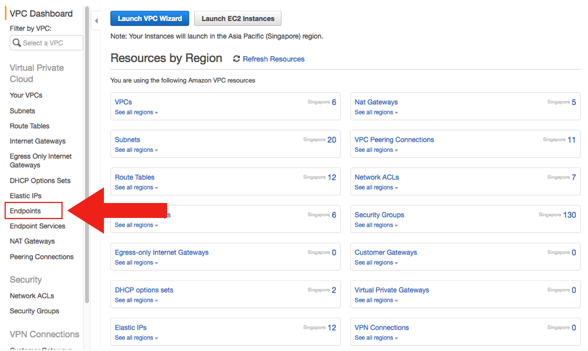
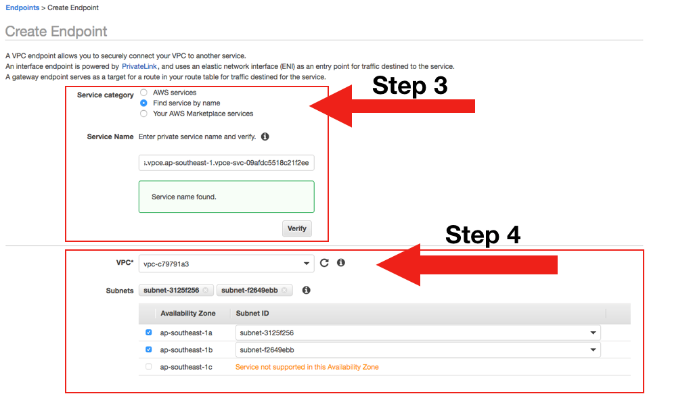
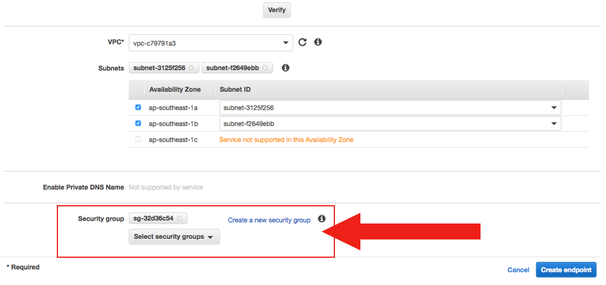
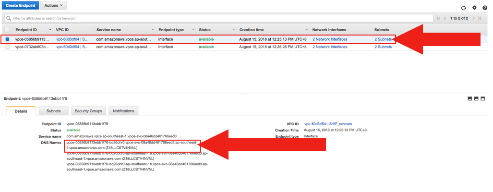
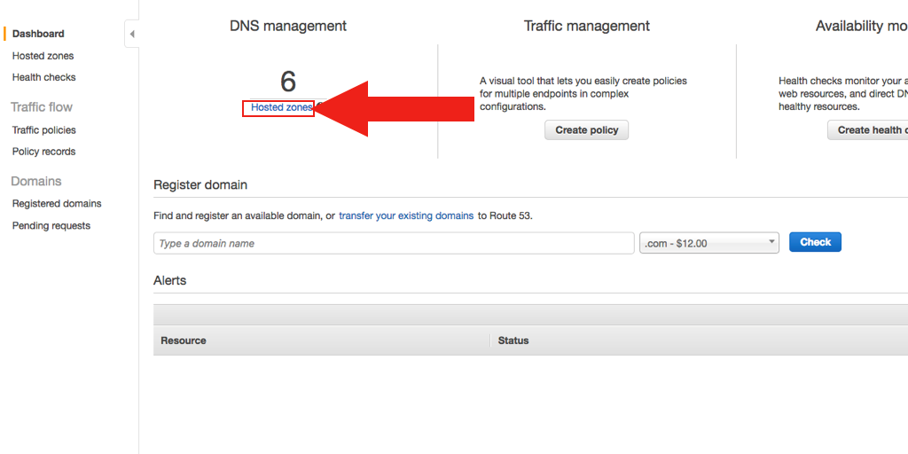
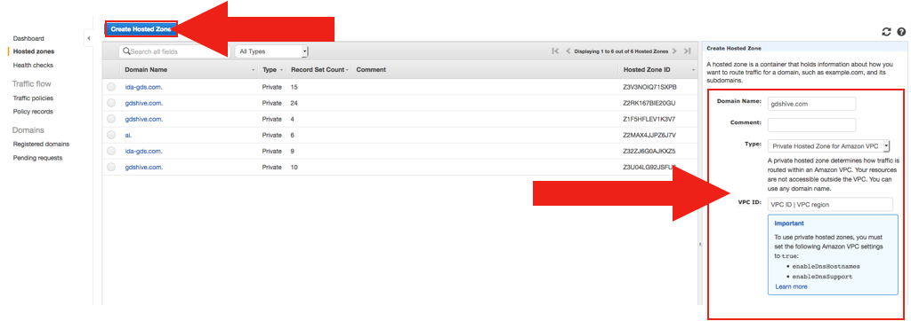
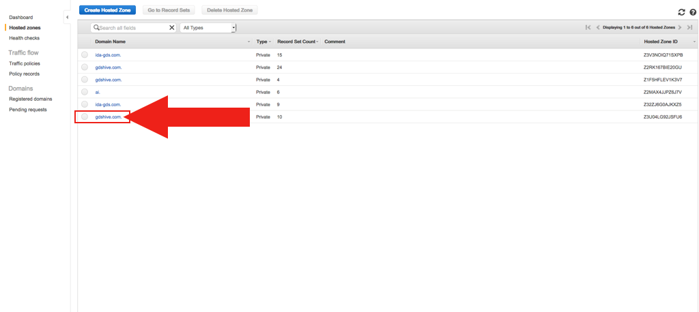
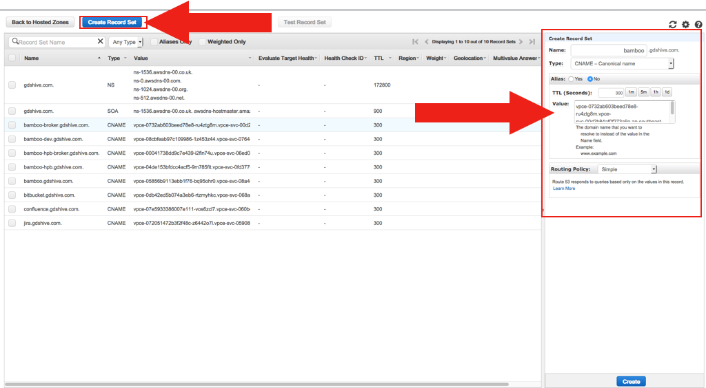

# Set up AWS VPC Endpoint Connections

**Topics** 
- [Connect to SHIP AWS VPC Endpoint](#connect-to-ship-aws-vpc-endpoint)
- [Create a VPC Endpoint](#create-a-vpc-endpoint)
- [Point the full URL to Endpoint](#point-the-full-url-to-the-endpoint-dns-name-using-route-53)
- [Annex A (New Domain ship.gov.sg](#annex-a-new-domain-shipgovsg)
- [Annex B (EB DNS Name)](#annex-b-elb-dns-name)

## Connect to SHIP AWS VPC Endpoint
To connect to SHIPs AWS VPC Endpoint Connections, complete the following steps:
1.	[Create the endpoint via VPC Endpoints](#create-a-vpc-endpoint).
2.	[Configure your DNS server to point the full URL to the DNS name for the endpoint connection created](#point-the-full-url-to-the-endpoint-dns-name-using-route-53).  

For more information, refer to the [Annex A (New Domain ship.gov.sg)](#annex-a-new-domain-shipgovsg) documentation. Steps provide DNS configuration using AWS Route53. If you have a different DNS setup, you may proceed with your own configuration to point the full URL to the DNS name.

>**Note:** This VPC Endpoint request is open to all SHIP-HATS tools (For example, BitBucket, Bamboo, Nexus Repo, Nexus IQ)

## Create a VPC Endpoint
1.	[Raise a ticket in SHIP Service Desk](https://jira.ship.gov.sg/servicedesk/customer/portal/11/create/190) with the following details:
    - AWS Account ID
    - Service you would like to connect and why you are connecting
    - Is your account GCC Restricted

     

    > **Note:** Wait for us to confirm that we've added you to the whitelist before continuing with the next step.  
1.	Go to your AWS console, select **VPC**, and then select **Endpoints**.

    <Kbd></kbd>

1.	Click **Create Endpoint** > **Find Service By Name**, and then provide the endpoint service name that you want to connect to. You can choose the endpoint service based on information included in [Annex A (New Domain ship.gov.sg)](#annex-a-new-domain-shipgovsg).

    <Kbd></kbd>

1.	Select the VPC from which you want to connect, and then select the subnets in which the endpoints will be created. 
    >**Note:** Instances that are required to use this endpoint must have connectivity to the subnets specified.
1.	Use or create a new security group that allows incoming traffic from the port of the endpoint service to which you want to connect (specified in [Annex A (New Domain ship.gov.sg)](#annex-a-new-domain-shipgovsg)), then click **Create Endpoint**.

    <Kbd></kbd>

1.	Inform us that you have created the Endpoint connection and wait for us to approve the connection.
1.	After the Endpoint connection is approved, select the newly approved endpoint connection, and then copy the first DNS name of the endpoint connection, starting from *vpce* and ending in *amazonaws.com*. Exclude the text in brackets. In the example screenshot below, the string to be copied will be *vpce-05856b9113ebb1f76-bq95ohr0.vpce-svc-08a46dd461766eed3.ap-southeast-1.vpce.amazonaws.com*. This will be the DNS name to which you will point the full URL as specified in the [Annex A (New Domain ship.gov.sg)](#annex-a-new-domain-shipgovsg) documentation.

    <Kbd></kbd>

## Point the Full URL to the Endpoint DNS Name using Route 53
1.	Go to Route 53 in your AWS console, and then click **Hosted Zones**. 

    <Kbd></kbd>

**Note:** You are required to complete the next step one time for each VPC. If you have complete this step for another endpoint connection, proceed to next step. 
1.	Click Create Hosted Zone, and then provide the following information:
    - In the **Domain Name** field, enter *ship.gov.sg*
    - In the **Type** field, select **Private Hosted Zone for Amazon VPC**
    - In the **VPC ID** field, select the VPC in which you created the endpoint connections 

    <Kbd></kbd>

1.	On your VPC, enable DNS hostnames and DNS Support.
1.	Click the ship.gov.sg private hosted zone that you newly created, or created previously for your VPC. Make sure that it is the correct hosted zone for your VPC in which you just created the endpoints, as you may have created multiple hosted zones with the same domain for different VPCs. 

    <Kbd></kbd>

1.	Click **Create Record Set**, and then provide the following information: 
    - In the **Name** field, enter the service name (specified in Annex A (New Domain ship.gov.sg)). 
    - In the **Type** field, select **CNAME**.
    - In the **Value** field, paste the domain name that you copied in last step in the [Create a VPC Endpoint]() task. 
1.	Click **Create**.

    <Kbd></kbd>

1.	After the DNS is propagated, test for connectivity to the endpoint service from one of your instances in the specified VPC.

## Annex A (New Domain ship.gov.sg)

The following table provides a list of SHIP VPC Endpoint Services:

|Service Name|Full URL|Endpoint Service Name|Port  |Protocol|  
|---|---|---|---|---|  
|bamboo|	bamboo.ship.gov.sg	|com.amazonaws.vpce.ap-southeast-1.vpce-svc-0657510c3a7762b6f	|443|HTTPS
bamboo-broker	|bamboo-broker.ship.gov.sg	|com.amazonaws.vpce.ap-southeast-1.vpce-svc-008954c10251142f9	|54663	|TCP
jira	|jira.ship.gov.sg	|com.amazonaws.vpce.ap-southeast-1.vpce-svc-0492f7adf5bb67146	|443	|HTTPS
confluence	|confluence.ship.gov.sg	|com.amazonaws.vpce.ap-southeast-1.vpce-svc-07e67c33544be9cda	|443	|HTTPS
bitbucket	|bitbucket.ship.gov.sg	|com.amazonaws.vpce.ap-southeast-1.vpce-svc-0288bd77b210ce764	|443	|HTTPS
bitbucket-ssh	|bitbucket-ssh.ship.gov.sg	|com.amazonaws.vpce.ap-southeast-1.vpce-svc-09ae67071cc4155c9	|7999|SSH
ldaps|ldap.ship.gov.sg	|com.amazonaws.vpce.ap-southeast-1.vpce-svc-062e406ddc5735824	|636	|LDAPS
nexus	|nexus.ship.gov.sg	|com.amazonaws.vpce.ap-southeast-1.vpce-svc-00a8a54d9f182060b	|443	|HTTPS
nexus-iq	|nexus-iq.ship.gov.sg	|com.amazonaws.vpce.ap-southeast-1.vpce-svc-0f943b15e6ba3c10f	|443	|HTTPS
nexus-docker-publish	|nexus-docker-publish.ship.gov.sg	|com.amazonaws.vpce.ap-southeast-1.vpce-svc-0e558148cb23bf366	|443	|HTTPS
synchrony	|synchrony.ship.gov.sg	|com.amazonaws.vpce.ap-southeast-1.vpce-svc-04e856bb03a8eea39	|443	|HTTPS
nexus-docker	|nexus-docker.ship.gov.sg	|com.amazonaws.vpce.ap-southeast-1.vpce-svc-03a2daafe0285a4a3	|443	|HTTPS
Internal |Gitlab	gitlab-in.ship.gov.sg	|com.amazonaws.vpce.ap-southeast-1.vpce-svc-028f4546e3e8ca3c1	|22 443|SSH HTTPS
crowd	|crowd.ship.gov.sg	|com.amazonaws.vpce.ap-southeast-1.vpce-svc-0a56697879b1af9e4	|443	|HTTPS

## Annex B (ELB DNS Name)
|Service Name|Full URL|Endpoint Service Name|Port  |Protocol|  
|---|---|---|---|---|  
bamboo	|bamboo.ship.gov.sg	|internal-core-elbv2-31kf1a3hk9vj-363642585.ap-southeast-1.elb.amazonaws.com	|443	|HTTPS
jira	|jira.ship.gov.sg	|internal-core-elbv2-1aky00ysoapgp-2070253092.ap-southeast-1.elb.amazonaws.com	|443	|HTTPS
confluence	|confluence.ship.gov.sg	|internal-core-elbv2-1a02clv7aa5lk-1096106939.ap-southeast-1.elb.amazonaws.com	|443	|HTTPS
synchrony	|synchrony.ship.gov.sg	|internal-core-elbv2-onsen5jwpdop-375029660.ap-southeast-1.elb.amazonaws.com	|443	|HTTPS
bitbucket	|bitbucket.ship.gov.sg	|internal-core-elbv2-15g7qgznbv7l2-267674817.ap-southeast-1.elb.amazonaws.com	|443	|HTTPS
gdsjira	|gdsjira.ship.gov.sg	|internal-core-elbv2-pv88ybqi62mk-2067584807.ap-southeast-1.elb.amazonaws.com.	|443	|HTTPS
gitlab	|gitlab.ship.gov.sg	|a0b4c89d0594d456387e26627d1576c8-1646589071.ap-southeast-1.elb.amazonaws.com.	|443	|HTTPS
gitlab internal	|gitlab-in.ship.gov.sg	|internal-ab89c544bd2b74f3c9d385d2f00cf3ed-1512138197.ap-southeast-1.elb.amazonaws.com.	|443	|HTTPS
portal aftervpn	|www.ship.gov.sg	|dualstack.internal-e5117b11-shipportalaftervp-4d59-1543672032.ap-southeast-1.elb.amazonaws.com	|443	|HTTPS
nexus iq	|nexus-iq.ship.gov.sg	|internal-core-elbv2-jsf7ism6p62j-458266190.ap-southeast-1.elb.amazonaws.com	|443	|HTTPS
nexus repo	|nexus.ship.gov.sg	|internal-core-elbv2-15osky7qzqe2d-1155554310.ap-southeast-1.elb.amazonaws.com	|443	|HTTPS
nexus docker proxy	|nexus-docker.ship.gov.sg	|internal-core-elbv2-16cz1qfw81fml-1884259492.ap-southeast-1.elb.amazonaws.com	|443	|HTTPS
nexus docker hosted	|nexus-docker-publish.ship.gov.sg	|internal-core-elbv2-1b6x6dnynp0kn-1611316980.ap-southeast-1.elb.amazonaws.com	|443	|HTTPS