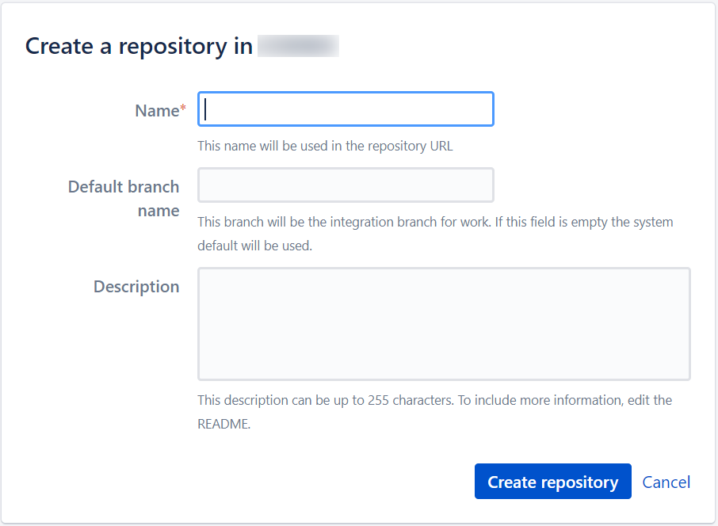

# Bitbucket

## Pre-requisite
- You must have [Admin permission](bitbucket-user-role) to add a repository.

## Create a Repository

### To create a repository:

1. Go to the [SHIP-HATS portal](https://bitbucket.ship.gov.sg/).
1. Click **Projects**.
1. Select the project for which you want to add a repository.
1. Click **Create repository**.
1. Add the required details, and then click **Create repository**.  
    
    <kbd></kbd>

## Related resources

For additional information, refer to following links:
- https://support.atlassian.com/bitbucket-cloud/resources/
- https://support.atlassian.com/bitbucket-cloud/docs/set-up-your-repositories/

<!--
**Topics**

- [Bitbucket User Roles and Permission](bitbucket-user-role)
- [Security for Bitbucket](ship-bitbucket-security)
- [Protect changes to sensitive files/folders](ship-bitbucket-protect-changes-sensitive)

- [Best Practices]()
- [Agency education links for ship services]()
- [FAQs](ship-bitbucket-faqs)
-->