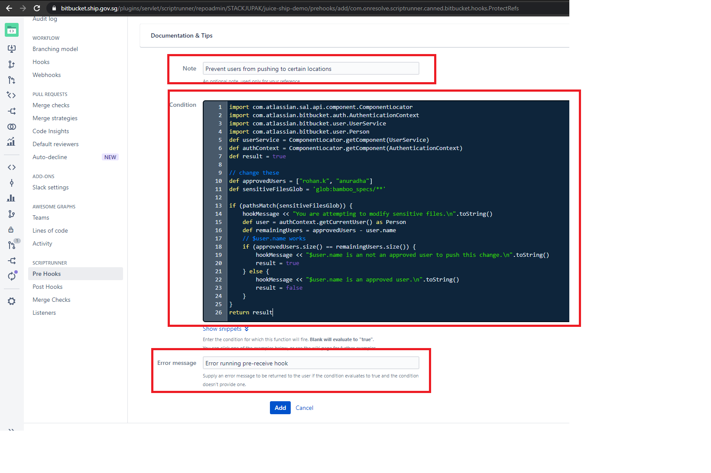

# Bitbucket: Protect changes to sensitive files/folders

Sometimes, you may want to prevent changes to sensitive folders in bitbucket, and the default Bitbucket permissions are not granular enough. To accomplish this, we can configure a pre-receive hook at the repository level using the ScriptRunner plugin for bitbucket. The steps to do this are given below:

>**NOTE:** you must be AT LEAST an admin in the repository where you wish
to configure the hook.

1. Navigate to the repository settings:

    

1. Go to Script Runner properties.

    

1. Click **Create Hook**.

    

Following is a sample code:

**Protect Sensitive folders**
```
import com.atlassian.sal.api.component.ComponentLocator
import com.atlassian.bitbucket.auth.AuthenticationContext
import com.atlassian.bitbucket.user.UserService
import com.atlassian.bitbucket.user.Person
def userService = ComponentLocator.getComponent(UserService)
def authContext = ComponentLocator.getComponent(AuthenticationContext)
def result = true
 
// change these
def approvedUsers = ["approved_user1", "approved_user2"]
def sensitiveFilesGlob = 'glob:path/to/sensitive/folder/**'
 
if (pathsMatch(sensitiveFilesGlob)) {
    hookMessage << "You are attempting to modify sensitive files.\n".toString()
    def user = authContext.getCurrentUser() as Person
    def remainingUsers = approvedUsers - user.name
    // $user.name works
    if (approvedUsers.size() == remainingUsers.size()) {
        hookMessage << "$user.name is an not an approved user to push this change.\n".toString()
        result = true
    } else {
        hookMessage << "$user.name is an approved user.\n".toString()
        result = false
    }
}
return result
```


