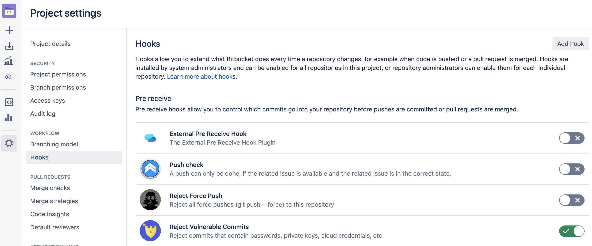
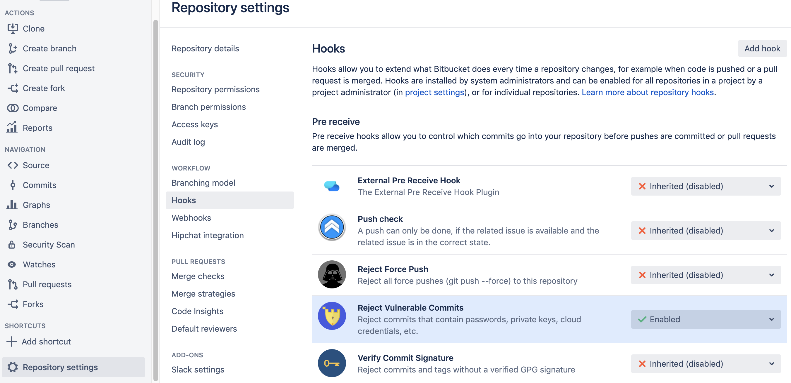
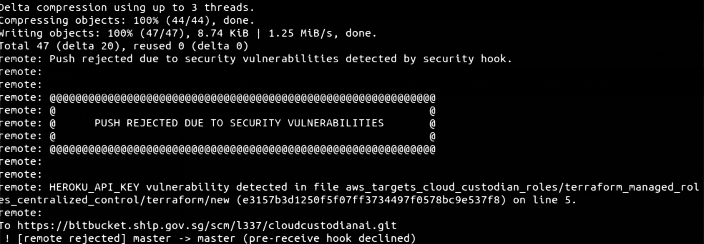

# Security for Bitbucket

Security for Bitbucket is a plugin that automatically rejects all Git commits containing hardcoded secrets (for example, credentials, keys, hooks, or tokens) from being pushed to your Bitbucket repository. This plugin helps to ensure that your source code repository does not contain any hardcoded secrets in the source code that should not be pushed into the Bitbucket repository.

## List of common hardcoded secrets currently caught by Security for Bitbucket

  | **Common Keys** | **Supported** |
  | --- | --- | 
  | EC keys | SUPPORTED |
  | Generic secret | SUPPORTED |
  | Generic API keys (most general hash that an API key  will match with) | SUPPORTED |                            
  | PKCS8 (private keys generally used on unix machines) | SUPPORTED |                                            
  | Generic API keys (most general hash that an API key WILL MATCH WITH) | SUPPORTED |                                  
  | SSH keys | SUPPORTED |
  | Passwords in URL\'s | SUPPORTED |
  | PGP keys | SUPPORTED |
  | PKCS8 (private keys generally used on unix machines) | SUPPORTED |                                        
  | Password detection (people storing passwords in plain text) | SUPPORTED |                                       
  | Custom key and pattern detection through advanced regex use |  SUPPORTED |
                                     

| **API Keys** | **Supported** |
| --- | --- | 
  | AWS client ID\'s | SUPPORTED |
  | AWS secret keys| SUPPORTED |
  | AWS MWS keys   | SUPPORTED |
  | Facebook secret keys | SUPPORTED |
  | Facebook client ID\'s| SUPPORTED |
  | Facebook access tokens | SUPPORTED |
  | Github keys    | SUPPORTED |
  | Google API key | SUPPORTED |
  | Google Cloud Platform API key | SUPPORTED |
  | Google OAUTH access token     | SUPPORTED |
  | Heroku API key | SUPPORTED |
  | LinkedIn client ids  | SUPPORTED |
  | Mailchimp API key| SUPPORTED |
  | Mailgun API key| SUPPORTED |
  | Paypal BrainTree access tokens| SUPPORTED |
  | Picatic API keys | SUPPORTED |
  | Slack keys     | SUPPORTED |
  | Slack webhooks | SUPPORTED |
  | Square access tokens | SUPPORTED |
  | Square Oauth secrets | SUPPORTED |
  | Stripe API key | SUPPORTED |
  | Twilio API key | SUPPORTED |
  | Twitter client ID\'s | SUPPORTED |
  | Twitter secret keys  | SUPPORTED |
  
---  

**Source:** <https://mohamicorp.atlassian.net/wiki/spaces/DOC/pages/955383813/Current+Vulnerabilities+Detected+by+Security+for+Bitbucket+Server>

For a list of example secrets that are caught by Security for Bitbucket, refer to the following link:

<https://mohamicorp.atlassian.net/wiki/spaces/DOC/pages/955449420/Example+Vulnerabilities+Caught+with+Security+for+Bitbucket+Server>

## Whitelisting detected secrets

If hardcoded credentials are detected, tenants should either remove them from source code, or if **absolutely necessary**, whitelist each secret on a case-by-case basis. This can be done by adding an inline comment appended to the end of the link containing the secret with the comment *pragma: allowlist secret*. For example, a whitelisted secret in Python would look like the following:

```
    def hello():
        db_pass = \"thisismydbpasswd\" \# pragma: allowlist secret
```

>**Note:** the comment is an inline comment (this means that it is on the same line as the hardcoded secret in question, not on a separate line) and is appended to the end of the line containing the secret.

## Scanning Bitbucket Repository

To see how to scan your Bitbucket repository for hardcoded secrets using Security for Bitbucket, refer to the following link:

<https://mohamicorp.atlassian.net/wiki/spaces/DOC/pages/1141506049/Scanning+your+Repositories+for+Vulnerabilities+with+Security+for+Bitbucket>

### To activate on your Bitbucket project:

1. Go to **Project settings** > **Hooks (under Workflow)** .
2. Select **Reject Vulnerable Commits** to enable.

    

### To activate on your Bitbucket source code repository:

1. Go to **Repository settings** > **Hooks (under "Workflow)**.
1. Under the multi-select field beside **Reject Vulnerable Commits**, select **Enabled**.

    

## FAQs

<details>
<summary>I tried to commit my code and got a security message. What should I do?
</summary>
<br>
If you tried to commit a code with some hardcoded password or keys, you
may see this security message like the one below. 

<br >



<br >
Notice the error on the finding at line 5. You will notice that security for Bitbucket assumed as a hardcoded secret key.  

To resolve this, you can complete one of the following steps:
- You can store your secrets in a more secure manner as a best
practice
- Add a comment `pragma: allowlist secret` to whitelist
your hardcoded secret key if **absolutely necessary**. 
</details>
