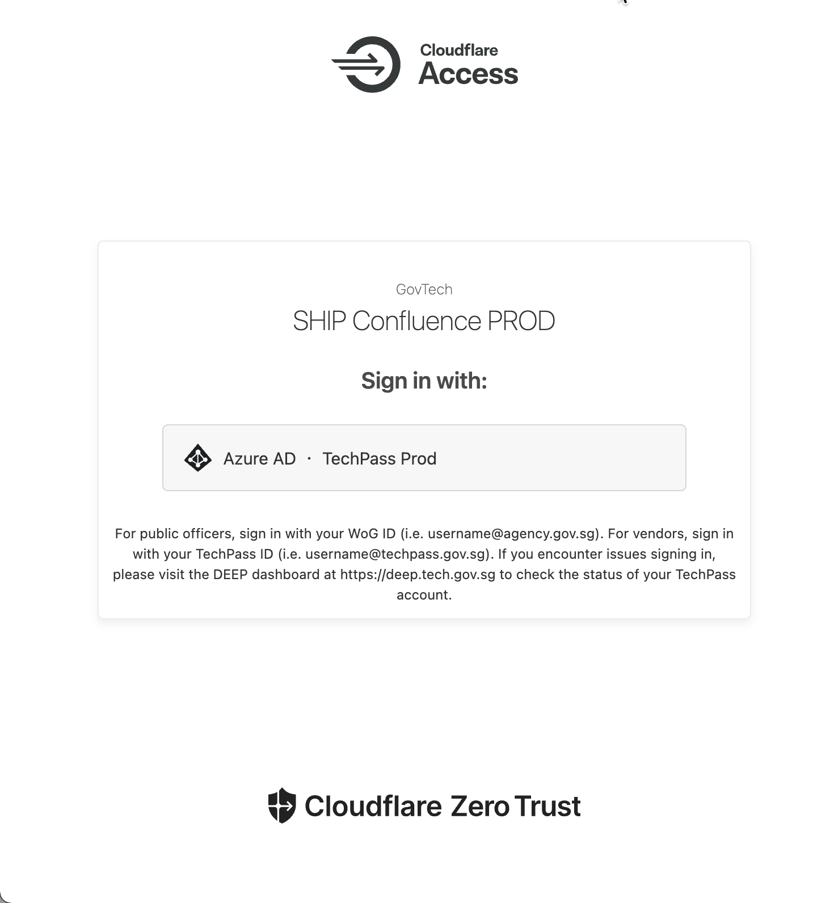
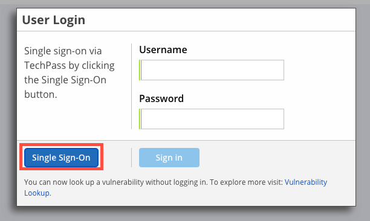
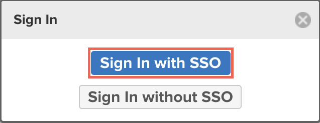
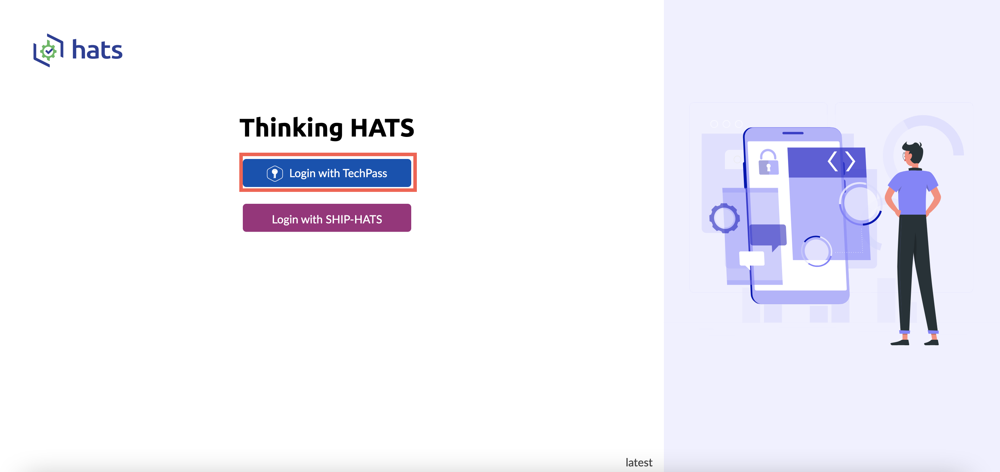

# Use TechPass to access SHIP-HATS and tools 

With the introduction of TechPass as Single Sign-On to access SHIP-HATS and the integrated tools on both GSIB and GMD devices, minor changes are made to the login process. 

After TechPass is enabled, you will observe the following changes in accessing the tools:  

## Confluence, Jira, GDSJira, Bitbucket, and Bamboo

The log in steps are similar for the tools listed below. For documentation purposes, we will be using Confluence as an example.  
>**Note:** The steps may vary based on the validity of the different authenticator tokens.  

- [Confluence](http://confluence.ship.gov.sg)
- [Jira](http://jira.ship.gov.sg)
- [GDSJira](http://gdsjira.ship.gov.sg)
- [Bitbucket](http://bitbucket.ship.gov.sg)
- [Bamboo](http://bamboo.ship.gov.sg)

### To log in to Confluence:

1. Go to [Confluence](http://confluence.ship.gov.sg).  
    You will be directed to Cloudflare.
1. Select **Azure AD**.  
    
    
    
    If you have not logged into your TechPass, you will be prompted to sign in. For more details, refer to the [TechPass user guide](https://docs.developer.tech.gov.sg/docs/techpass-user-guide/#/) if you are logging in to TechPass for the first time.

1. Authenticate and approve your TechPass login using your Microsoft authenticator app with your SG Govt M365 profile.  
After you have authenticated, you will be redirected to your dashboard. 

    >**Note:** For Bitbucket, you will see the public repository before logging in.  

## Nexus IQ
### To log in to Nexus IQ:
 
1. Go to [Nexus IQ](https://nexus-iq.ship.gov.sg/).
1. On the login dialog, click **Single Sign-On**.  
    
    
    
    If you have not logged into your TechPass, you will be prompted to sign in. For more details, refer to the [TechPass user guide](https://docs.developer.tech.gov.sg/docs/techpass-user-guide/#/) if you are logging in to TechPass for the first time.
    
1. Authenticate and approve your TechPass login using your Microsoft authenticator app with your SG Govt M365 profile. 
1. After you have authenticated, you will be redirected to your Nexus IQ dashboard.

## Nexus Repo

### To log in to Nexus Repo:

1. Go to [Nexus Repo](https://nexus.ship.gov.sg/).
1. Click **Sign in**.
1. Click **Sign In with SSO**.  
        
         
      
    
    If you have not logged into your TechPass, you will be prompted to sign in. For more details, refer to the [TechPass user guide](https://docs.developer.tech.gov.sg/docs/techpass-user-guide/#/) if you are logging in to TechPass for the first time.   
1. Authenticate and approve your TechPass login using your Microsoft authenticator app with your SG Govt M365 profile. 
1. After you have authenticated, you will be redirected to your Nexus Repo dashboard.

## Fortify SSC

### To log in to Fortify SSC:

1. Go to [Fortify SSC](https://ssc.hats.stack.gov.sg/).  
    If you have not logged into your TechPass, you will be prompted to sign in. For more details, refer to the [TechPass user guide](https://docs.developer.tech.gov.sg/docs/techpass-user-guide/#/) if you are logging in to TechPass for the first time. 
1. Authenticate and approve your TechPass login using your Microsoft authenticator app with your SG Govt M365 profile. 
1. After you have authenticated, you will be redirected to your Fortify SSC dashboard.

## Fortify WebInspect

Currently you are required to log in to Fortify SSC before logging in to WebInspect.

1. Log in to [Fortify SCC](https://ssc.hats.stack.gov.sg/).
1. Log in to [WebInspect](https://wie.hats.stack.gov.sg).

## SonarQube

### To log in to SonarQube: 

1. Go to [SonarQube](https://sonar.hats.stack.gov.sg/sonar).
1. Click **Log in with SAML**.

    

    If you have not logged into your TechPass, you will be prompted to sign in. For more details, refer to the [TechPass user guide](https://docs.developer.tech.gov.sg/docs/techpass-user-guide/#/) if you are logging in to TechPass for the first time.
1. Authenticate and approve your TechPass login using your Microsoft authenticator app with your SG Govt M365 profile. 
1. After you have authenticated, you will be redirected to your SonarQube dashboard.

## Thinking HATS

### To log in to Thinking Hats:

1. Go to [Thinking HATS](https://thinking.hats.stack.gov.sg/).
1. Click **Login with TechPass**.

    

    If you have not logged into your TechPass, you will be prompted to sign in. For more details, refer to the [TechPass user guide](https://docs.developer.tech.gov.sg/docs/techpass-user-guide/#/) if you are logging in to TechPass for the first time.

1. Authenticate and approve your TechPass login using your Microsoft authenticator app with your SG Govt M365 profile. 
1. After you have authenticated, you will be redirected to your Thinking HATS dashboard.

