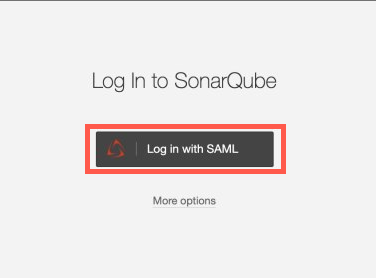

# Use TechPass to access SHIP-HATS and tools 

With the introduction of TechPass as a Single Sign-On to access SHIP-HATS and the integrated tools on both GSIB and GMD devices, minor changes are made to the login process. 

?> Once TechPass is enabled, you will see the changes below.  

Following are the changes in accessing the tools. 

## Steps to log in with TechPass for Confluence, Jira, GDSJira, Bitbucket and Bamboo

The log in steps is similar for the tools below. For documentation purposes, we will be using Confluence as an example. 

* [Confluence](http://confluence.ship.gov.sg)
* [Jira](http://jira.ship.gov.sg)
* [GDSJira](http://gdsjira.ship.gov.sg)
* [Bitbucket](http://bitbucket.ship.gov.sg)
* [Bamboo](http://bamboo.ship.gov.sg)

?> Depending on the validity of the different authenticator tokens, the steps may vary 

1. Go to [Confluence](http://confluence.ship.gov.sg)
2. You will be directed to Cloudflare
3. Choose **Azure AD**

4. You will be prompted to sign in to your TechPass if you have not logged in. Proceed to step 6 if you are already logged into TechPass. 
5. Refer to [TechPass user guide](https://docs.developer.tech.gov.sg/docs/techpass-user-guide/#/)if you are logging in to TechPass for the first time.
6. Authenticate and approve your TechPass login using your Microsoft authenticator app with your SG Govt M365 profile. 
7. Once authenticated, you will be redirected to your dashboard. 

?> For Bitbucket, you will see the public repository before logging in.
 
## Steps to log in with TechPass for Nexus IQ
 
1. Go to [Nexus IQ](https://nexus-iq.ship.gov.sg/)
2. Click **Single Sign-On(SSO)** on the login dialog.

3. You will be prompted to sign in to your TechPass if you have not logged in. Proceed to step 5 if you are already logged into TechPass. 
4. Refer to [TechPass user guide](https://docs.developer.tech.gov.sg/docs/techpass-user-guide/#/)if you are logging in to TechPass for the first time.
5. Authenticate and approve your TechPass login using your Microsoft authenticator app with your SG Govt M365 profile. 
6. Once authenticated, you will be redirected to your Nexus IQ dashboard.

## Steps to log in with TechPass for Nexus Repo

1. Go to [Nexus Repo](https://nexus.ship.gov.sg/)
2. Click **Sign in**.
3. Click **Sign with SSO**.

4. You will be prompted to sign in to your TechPass if you have not logged in. Proceed to step 6 if you are already logged into TechPass. 
5. Refer to [TechPass user guide](https://docs.developer.tech.gov.sg/docs/techpass-user-guide/#/)if you are logging in to TechPass for the first time.
6. Authenticate and approve your TechPass login using your Microsoft authenticator app with your SG Govt M365 profile. 
7. Once authenticated, you will be redirected to your Nexus Repo dashboard.

## Steps to log in with TechPass for Fortify SSC
1. Go to [Fortify SSC](https://ssc.hats.stack.gov.sg/)
2. You will be prompted to sign in to your TechPass if you have not logged in. Proceed to step 4 if you are already logged into TechPass. 
3. Refer to [TechPass user guide](https://docs.developer.tech.gov.sg/docs/techpass-user-guide/#/)if you are logging in to TechPass for the first time.
4. Authenticate and approve your TechPass login using your Microsoft authenticator app with your SG Govt M365 profile. 
5. Once authenticated, you will be redirected to your Fortify SSC dashboard.

## Steps to log in with TechPass for Fortify WebInspect
1. Log in to [Fortify SCC](https://ssc.hats.stack.gov.sg/)
2. Log in to [WebInspect](https://wie.hats.stack.gov.sg)

Currently you are required to log in to Fortify SSC before logging in to WebInspect.

## Steps to log in with TechPass for Sonarqube
1. Go to [Sonarqube](https://sonar.hats.stack.gov.sg/sonar)
2. Click **Log in with SAML**.

3. You will be prompted to sign in to your TechPass if you have not logged in. Proceed to step 5 if you are already logged into TechPass. 
4. Refer to [TechPass user guide](https://docs.developer.tech.gov.sg/docs/techpass-user-guide/#/)if you are logging in to TechPass for the first time.
5. Authenticate and approve your TechPass login using your Microsoft authenticator app with your SG Govt M365 profile. 
6. Once authenticated, you will be redirected to your Sonarqube dashboard.

## Steps to log in with TechPass for Thinking HATS
1. Go to [Thinking HATS](https://thinking.hats.stack.gov.sg/)
2. Click **Log in with TechPass**

3. You will be prompted to sign in to your TechPass if you have not logged in. Proceed to step 5 if you are already logged into TechPass. 
4. Refer to [TechPass user guide](https://docs.developer.tech.gov.sg/docs/techpass-user-guide/#/)if you are logging in to TechPass for the first time.
5. Authenticate and approve your TechPass login using your Microsoft authenticator app with your SG Govt M365 profile. 
6. Once authenticated, you will be redirected to your Thinking HATS dashboard.

