# Scan via API

**Topics**  

1. [Prerequisites](#prerequisites)
1. [Generate an Authentication Token](#generate-an-authentication-token)
1. [Get Project Version Data](#get-project-version-data)
1. [Choose a Scan Policy](#choose-a-scan-policy)
1. [Run the Scan without Login Macro](#run-the-scan-without-login-macro)
1. [Record a Login Macro](#record-a-login-macro)
1. [Create and Upload MacroData](#create-and-upload-macrodata)
1. [Run the scan with Login Macro](#run-the-scan-with-login-macro)

## Prerequisites

- WIE server has access to your website
- Your agency has completed the onboarding process for WebInspect
- Your agency has access to SHIP bamboo
- Your agency has access to Fortify SSC

For web applications that **do not have a login** page, follow these steps:
<!--1,2,3, and 4a.-->
1. [Generate an Authentication Token](#generate-an-authentication-token)
1. [Get Project Version Data](#get-project-version-data)
1. [Choose a Scan Policy](#choose-a-scan-policy)
1. [Run the Scan without Login Macro](#run-the-scan-without-login-macro)

For web applications that **are protected by a login** page, follow these steps: 
<!--steps 1,2,3,4b,5, and 6.-->
1. [Generate an Authentication Token](#generate-an-authentication-token)
1. [Get Project Version Data](#get-project-version-data)
1. [Choose a Scan Policy](#choose-a-scan-policy)
1. [Record a Login Macro](#record-a-login-macro)
1. [Create and Upload MacroData](#create-and-upload-macrodata)
1. [Run the scan with Login Macro](#run-the-scan-with-login-macro)

## Generate an Authentication Token
To authenticate with the WIE API, an authentication token is required. 

<!-- tabs:start -->

### **LDAP Users**

### To generate the Authentication Token (LDAP Users)

1. Invoke the following cURL command. 

    The username and password credentials are similar to your Fortify SSC credentials.

  
    ### Command
    ```
    curl --location --request POST 'https://wie.hats.stack.gov.sg/wie/rest/api/v1/auth' \
    --header 'Accept: application/json' \
    --header 'Content-Type: application/json' \
    --data-raw '{
    "username": "username",
    "password": "password"
    }'
    ```
    ### Sample Response
    ```
    {
      "data": "FORTIFYTOKEN MDA2NDMzMDMtYjQ3NC00MGg89Tg0MDYtZjNkNmU3ZmI3YTBl",
      "responseCode": 200,
      "message": null
    }
    ```
    If you do not have the following JSON response, it is likely that your user account is unauthorized to use WIE. Please go to WIE Service Tickets for more details.

### **TechPass Users**

### To generate the Authentication Token (TechPass Users)

There are two options to get a valid authentication token for Techpass migrated users.
- [Option 1: Manually generate auth token in Fortify](#option-1-manually-generate-auth-token-in-fortify)
- [Option 2: Create/Use existing SHIP LDAP account to generate auth token](#option-2-createuse-existing-ship-ldap-account-to-generate-auth-token)

#### Option 1: Manually generate auth token in Fortify

This method is good when you are testing using your own account and running scans at an ad-hoc basis. But do note that it expires daily so it is not recommended for CICD.

1. Go to **Fortify SSC** > **Administration** > **Tokens** (https://ssc.hats.stack.gov.sg/ssc/html/ssc/admin/tokens), and then click **New**. 
1. Choose the **Token Type** as *UnifiedLoginToken*, provide value in the **Description** field, and then click **Save**. 

    <kbd>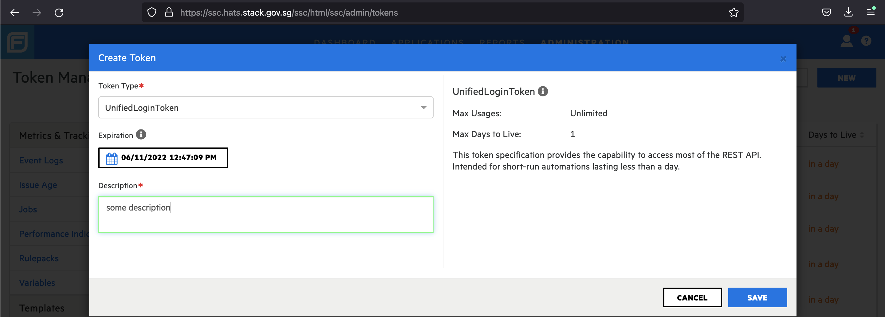 

    Encoded and decoded tokens are generated. Use the encoded token for WIE scans.

    <kbd>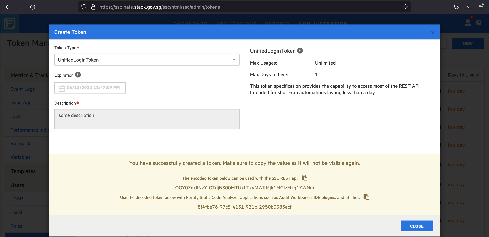 

#### Option 2: Create/Use existing SHIP LDAP account to generate auth token

1. As SHIP LDAP service accounts are not migrated to Techpass, you can still use the account's credentials to generate an auth token programmatically as shown in the [To generate the Authentication Token (LDAP Users)](#to-generate-the-authentication-token-ldap-users) documentation.
1. If you do not have service account in LDAP, you can raise an SR for the SHIP team to create one. You must raise a separate request for us to grant the user access to the [WIE - WebInspect Service Tickets Guide](webinspect-service-tickets-guide).

<!-- tabs:end -->


## Get Project Version Data

Similar to Fortify SCA scans, before scanning the application, WebInspect needs to know the specific Application Project Version before uploading the scan results.

### To get the projectVersions ID

1. Navigate to the application in Fortify SSC.

    <kbd>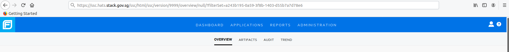

    Based on the browser URL above, the **projectVersions ID** is *9999*. 
    
1. Invoke the following cURL command to get the Project Version Data:

    <!-- tabs:start -->
    ### **Command**
    ```
    curl --location --request GET 'https://wie.hats.stack.gov.sg/wie/rest/api/v1/projectVersions/9999' \
    --header 'Accept: application/json' \
    --header 'Content-Type: application/json' \
    --header 'Authorization: FORTIFYTOKEN <token>'
    ```
    ### **Sample Response**
    You should get a response similar to the following response. The Project Version Data is the information bolded in black. Do store the information somewhere because we will be using it for other API calls later on.
    ```
    {
      "data": {
        "url": null,
        "project": {
          "id": 12345,
          "name": "Sample Application"
        },
        "securityGroup": {
          "id": "321g37-g31873-3h183-213j3",
          "name": "SAMPLE GROUP"
        },
        "organization": {
          "id": "u3yi3-31283-231hu-321h0",
          "name": "SAMPLE ORGANIZATION"
        },
        "permissions": {
          "PERM_SITE_CREATE": false,
          "PERM_SITE_GEN_REPORT": false,
          "PERM_SITE_DELETE": false,
          "PERM_SITE_UPDATE": true,
          "PERM_SITE_LINK_SCANS": true,
          "PERM_SITE_SCANS_CREATE": true,
          "PERM_SITE_SCHEDULED_SCANS_CREATE": false,
          "PERM_SITE_SCANS_REPEAT": true
        },
        "id": 12345,
        "name": "1.0",
        "siteId": "3Rc43121-4823-433e-ac85-h3021h120"
      },
      "links": {
        "scans": "https://wie.hats.stack.gov.sg/wie/rest/api/v1/projectVersions/9999/scans"
      },
      "responseCode": 200,
      "message": null
    }
      ```

    <!-- tabs:end -->


## Choose a Scan Policy

A Scan Policy is a collection of vulnerability checks and attack methodologies that WIE deploys against a Web application.

Based on best practices designed to test applications for the most pervasive and problematic web application security vulnerabilities, we recommend using one of the following policies with their policy ID attached.

- Select one of the following policy ID to continue with the scan process:
    - **OWASP Top 10 2021 (2387b73d-3a5f-4700-8ff2-85135e05d659):** This policy provides a minimum standard for web application security. The OWASP Top 10 2021 represents a broad consensus about the most critical web application security flaws.
    - **SANS Top 25 (1690337d-ae32-43ea-a008-bb0959a279fc):** The SANS Top 25 Most Dangerous Software Errors provides an enumeration of the most widespread and critical errors, categorised by Common Weakness Enumeration (CWE) identifiers, that lead to serious vulnerabilities in software.
    - **Standard (cb72a7c2-9207-4ee7-94d0-edd14a47c15c):** A standard scan includes an automated crawl of the server and performs checks for known and unknown vulnerabilities such as SQL Injection and Cross-Site Scripting as well as poor error handling and weak SSL configuration at the web server, web application server, and web application layers.
- Alternatively, you can invoke the **Get Scan Policies API** using the following cURL command if you view all the available policies that WebInspect has to offer:

    <!-- tabs:start -->
    ### **Command**
    ```
    curl --location --request GET 'https://wie.hats.stack.gov.sg/WIE/REST/api/v1/policies' \
    --header 'Authorization: {{auth_token}}'
    ```
    The cURL response will return a JSON Array with over 50 scan policies, including metadata such as description and policy category. You can go ahead and choose a scan policy that suits your needs better.

    The screenshot below shows how to find the policy ID (highlighted in yellow). 

    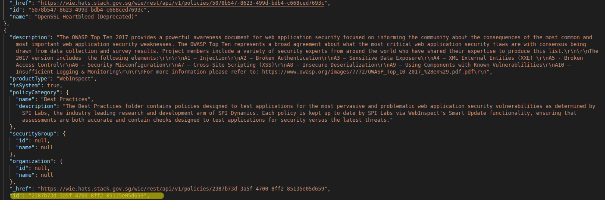
    <!-- tabs:end -->

## Run the Scan without Login Macro

>**Note:** If your web application is protected by a Login page, proceed to [Record a Login Macro](#record-a-login-macro).

1. Fill in the required information from previous steps, and then run the cURL command.
    >**Information from previous steps:** 
    >- Authorization: FORTIFYTOKEN MDA2NDMzMDMtYjQ3NC00MGg89Tg0MDYtZjNkNmU3ZmI3YTBl'
    After the scan is complete, you will be able to view the scan results in the Fortify SSC.
    >- "id": 12345,
    >- "name": "1.0",
    >- "siteId": "3Rc43121-4823-433e-ac85-h3021h120"

    <!-- tabs:start -->
    ### **Command**

    ```
    curl --location --request POST 'https://wie.hats.stack.gov.sg/wie/rest/api/v2/scans' \
    --header 'Accept: application/json' \
    --header 'Content-Type: application/json' \
    --header 'Authorization: FORTIFYTOKEN MDA2NDMzMDMtYjQ3NC00MGg89Tg0MDYtZjNkNmU3ZmI3YTBl' \
    --data-raw '{
    "name": "Sample Scan",
    "projectVersion": {"id": 12345, "name": "1.0", "siteId": "3Rc43121-4823-433e-ac85-h3021h120"},
    "overrides": {
    "startMethod": "url",
    "startUrls": [
    "https://sampleurl.com"
    ],
    "policyID": "2387b73d-3a5f-4700-8ff2-85135e05d659" }

    }'
    ```
    After running the API call, you should receive a response with a responseCode of 201 indicating that the resource (scan) is created. 

    >**Note:** Even though the scan is created, the scan may take some time to start depending on the number of pending scans in the queue.

    <!-- tabs:end -->


## Record a Login Macro
For web applications that have a login form, WebInspect will require a login macro to be created to crawl the website.

### To create and record a macro
1. Navigate to https://wie.hats.stack.gov.sg, and then log in with your Fortify SSC credentials. 
1. Download and install **WIEDesktop.exe**.

    >**Note:** WIEDesktop.exe supports Windows only. 

    <kbd>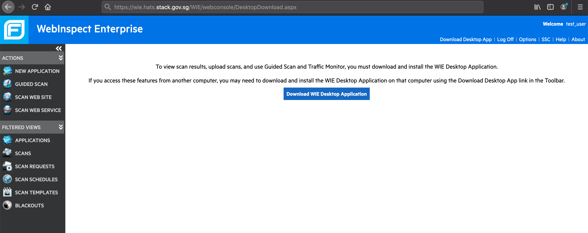

1. Click **Guided Scan**. 
    
    A window appears, asking permission to open WIEDesktop.exe.

    <kbd>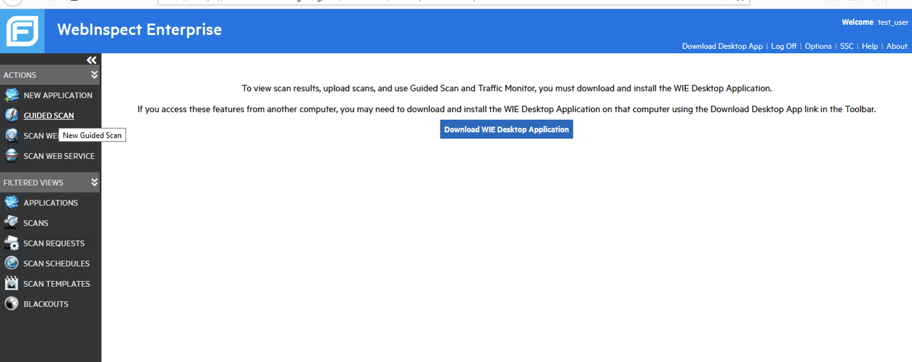
1. Clik **Open Link**.

    <kbd>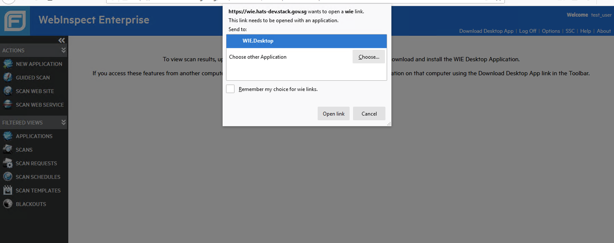
1. Select the **Create a Standard Web Site Scan** option. 

    <kbd>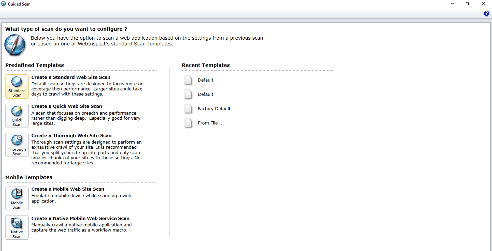
1. Fill in the Start URL with the URL for which you want to create a login macro. 

    <kbd>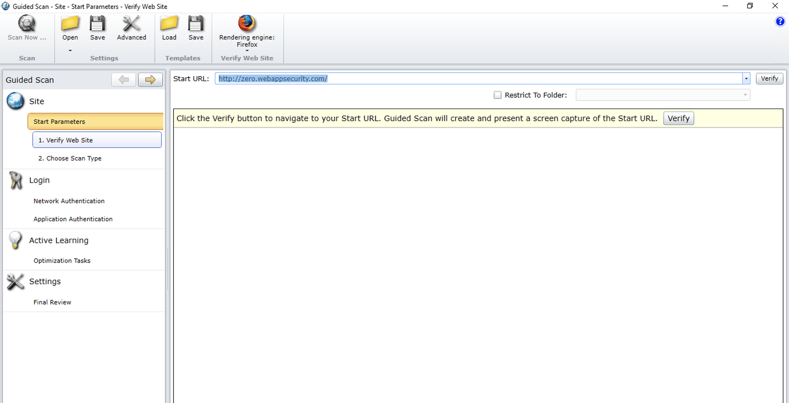

1. Click **Application Authentication**, and then click **Create**.  

    <kbd>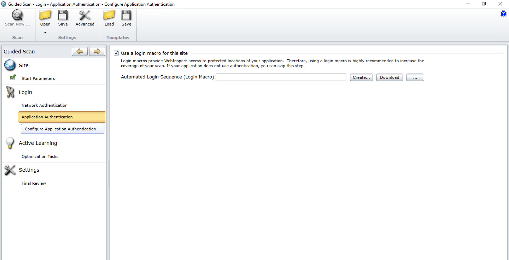

    This launches another window (Truclient) in which we will start our recording process. After Truclient is launched, you would notice that there are two panels in the foreground. The panel on the left contains controls that would help you record the macro. The panel on the right contains the browser in which the recording will be performed.

    <kbd>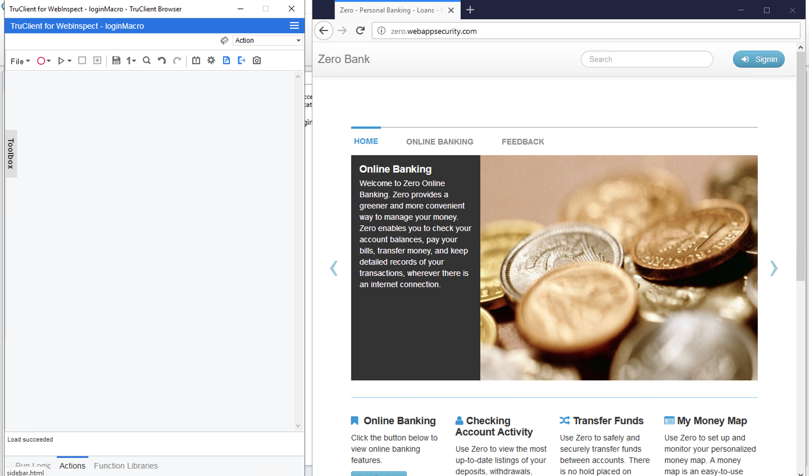    
1. Click the **Record** button to start recording. 

    <kbd>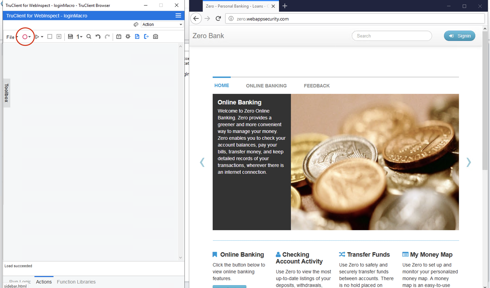

    The first action of navigating to the URL is detected and is indicated in the left panel. Recording in progress is indicated in the lower-left panel.
    <kbd>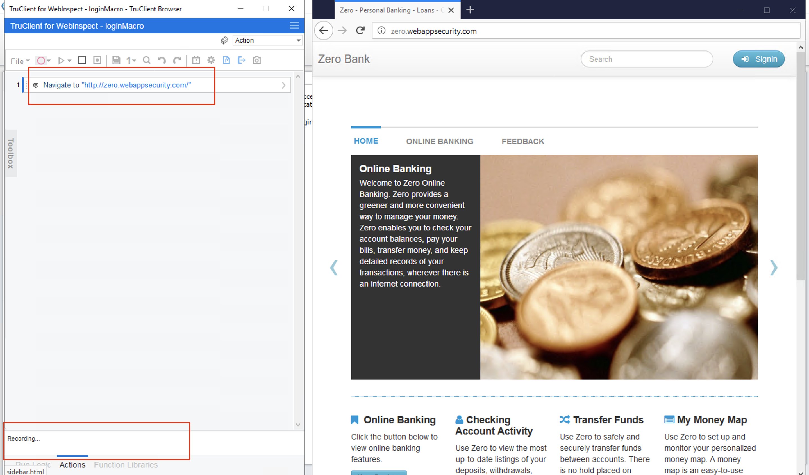
1. Log in as you would for a normal user. 

    > **Note:** The login macro file is encrypted. Therefore, there is no risk of your credentials being compromised.
    
    Your actions being populated are visible in the left panel.

    <kbd>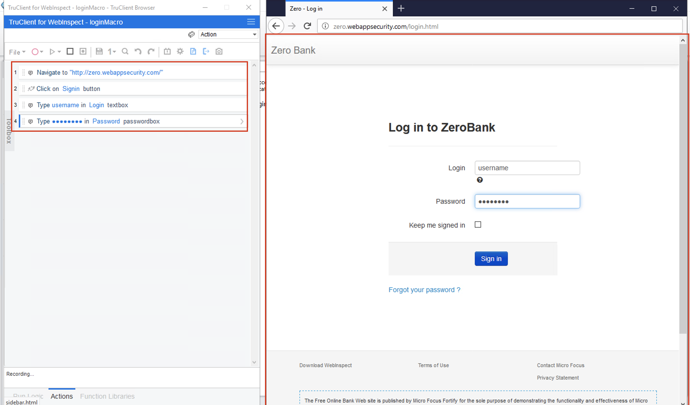
1. After you have logged in successfully, verify that all the actions are correctly populated. 
1. Click the **Stop** button.
    
    <kbd>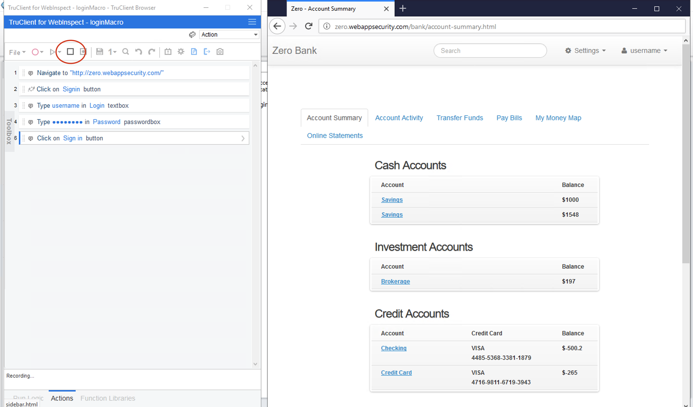

    The **Stop** button should be greyed out as shown below. Click the **Replay** button for the login macro to complete verification.
    
    <kbd>
    
    After completing the replay, the macro would require final step to verify that it has successfully reached a *login* state. 
1. Select a new object on the right panel to make sure that the macro knows that the login condition has been fulfilled. 
    
    For this demo, I clicked on the accounts panel. Depending on how your website is designed, you would need to click on an object on the website that is only shown when the user has logged in.

    <kbd>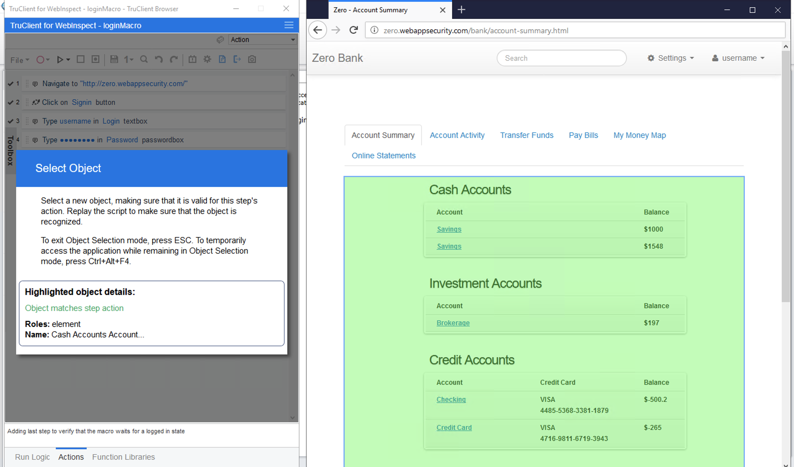

    After clicking an object on the right panel, you would see on the bottom left that the macro is now trying to automatically detect logout conditions. Do give it sometime to allow the macro to finish up the process.

    <kbd>

    After it is done, it will say Successfully created an automatic logout condition.

    <kbd>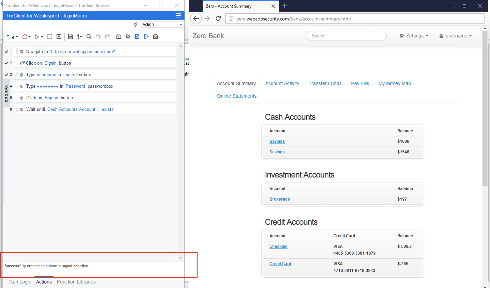

1. Click **Save As** to ensure that the login macro is successfully saved so that you can manually upload it for API scans in the future.

    <kbd>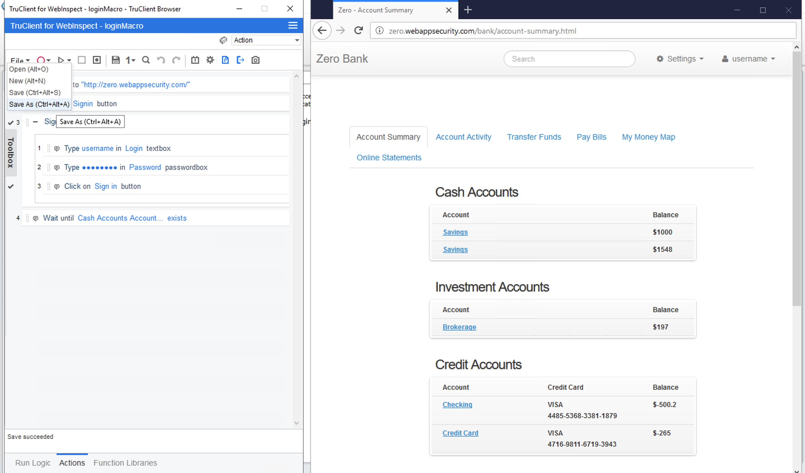

1. Save the login macro at any location and name the macro accordingly.

    <kbd>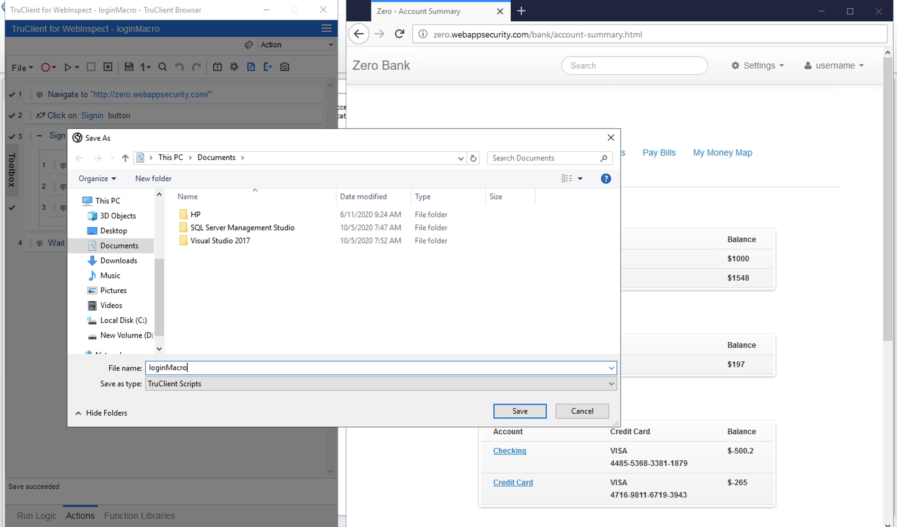

1. Click the **Close** button.

    <kbd>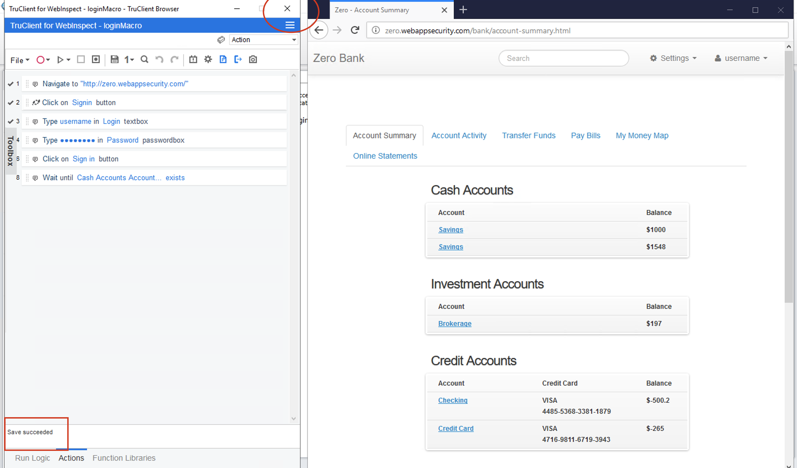

    The login macro has successfully been created and reflected on WIEDesktop application.

    <kbd>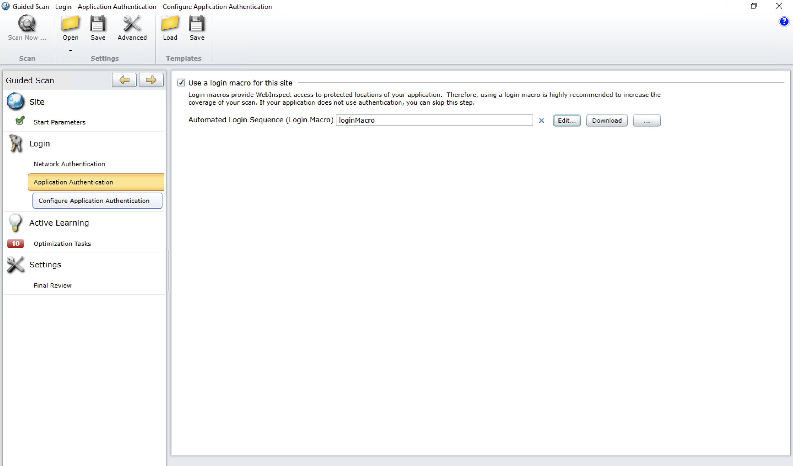

## Create and Upload MacroData

This step is only essential if the web application has a login form. Make sure that you have completed the [Record a Login Macro](#record-a-login-macro) step. 

**Topics**
1. [Create MacroData](#to-create-macrodata-for-a-project)
1. [Upload MacroData](#to-upload-macrodata-to-the-project)

### To create MacroData for a project

Run the following cURL request to create MacroData for your project. The values of `{{auth_token}}` and `{{projectVersion_data}}` are created in the [Generate an Authentication Token](#generate-an-authentication-token) and [Get Project Version Data](#get-project-version-data) steps respectively.

<!-- tabs:start -->
### **Command**
```
curl --location --request POST 'https://wie.hats.stack.gov.sg/wie/rest/api/v1/macros' \
--header 'Accept: application/json' \
--header 'Content-Type: application/json' \
--header 'Authorization: {{auth_token}}' \
--data-raw '{
"name": "Test Macro",
"projectVersion": {"id": 12345, "name": "1.0", "siteId": "3Rc43121-4823-433e-ac85-h3021h120"}
}'
```
### **Sample Response**

You should receive a response as shown below. Take note of the id value as you will use it for the uploading MacroData.

```
{
  "data": {
    "id": "87uu1b26d-5ca3-4d50-b011-c1e930bce0981",
    "name": "Test Macro",
    "lastUpdatedDate": "0001-01-01T00:00:00",
    "project": null,
    "projectVersion": {"id": 12345, "name": "1.0", "siteId": "3Rc43121-4823-433e-ac85-h3021h120"},
    "securityGroup": null,
    "organization": null
  },
  "responseCode": 201,
  "message": null
}
```
<!-- tabs:end -->


### To upload MacroData to the project

After the MacroData is created for the Project, upload the contents of the Macro you have created in the [Record a Login Macro](#record-a-login-macro) step. 

Use the id value generated in the previous step as reference to tell the server where we want the MacroData to be uploaded to.

Under `--form`, reference to absolute path of the Macro created in the [Record a Login Macro](#record-a-login-macro) step. For our example, we assume that the webmacro we created was saved at *C:/Users/Guest/Desktop/webmacro.webmacro*

Run the cURL command below.

<!-- tabs:start -->
### **Command**
```
curl --location --request POST 'https://wie.hats.stack.gov.sg/wie/rest/api/v1/macros/87uu1b26d-5ca3-4d50-b011-c1e930bce0981/macroData' \
--header 'Accept: application/json' \
--header 'Content-Type: multipart/form-data' \
--header 'Authorization: FORTIFYTOKEN {{auth_token}}' \
--form 'data=@/C:/Users/Guest/Desktop/webmacro.webmacro'
```
### **Sample Response**

You should receive a responseCode of 201 to show that the resource is successfully created. Do remember the values of your macro ID and macro name as they will be used in the final step.
```
{
  "data": null,
  "responseCode": 201,
  "message": null
}
```
Congratulations! You are now ready to [run a scan](#run-the-scan-with-login-macro) using your newly created Login Macro!


<!-- tabs:end -->

## Run the scan with Login Macro

Provide the information from the previous steps and run the following cURL command.
<!-- tabs:start -->
### **Command**
```
curl --location --request POST 'https://wie.hats.stack.gov.sg/wie/rest/api/v2/scans' \
--header 'Accept: application/json' \
--header 'Content-Type: application/json' \
--header 'Authorization: FORTIFYTOKEN MDA2NDMzMDMtYjQ3NC00MGg89Tg0MDYtZjNkNmU3ZmI3YTBl' \
--data-raw '{
"name": "Sample Scan",
"projectVersion": {"id": 12345, "name": "1.0", "siteId": "3Rc43121-4823-433e-ac85-h3021h120"},
"overrides": {
"startMethod": "url",
"startUrls": [
"https://sampleurl.com"
],
"policyID": "2387b73d-3a5f-4700-8ff2-85135e05d659",

"macroFileID": "87uu1b26d-5ca3-4d50-b011-c1e930bce0981",

"macroName": "Test Macro"

}

}'
```
<!-- tabs:end -->

After running the API call, you should receive a response with a responseCode of 201 indicating that the resource (scan) is created. Even though the scan is created, the scan may take some time to start depending on the number of pending scans in the queue.

After the scan is completed, you will be able to view the scan results in the Fortify SSC.