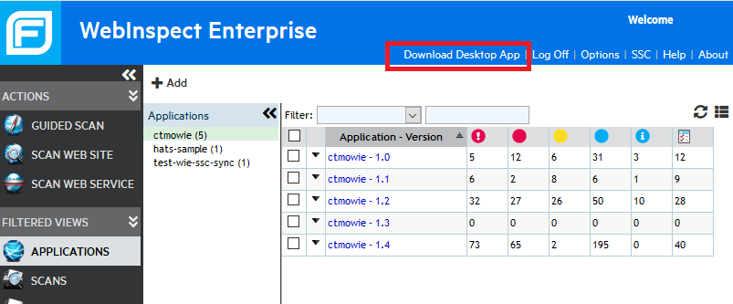
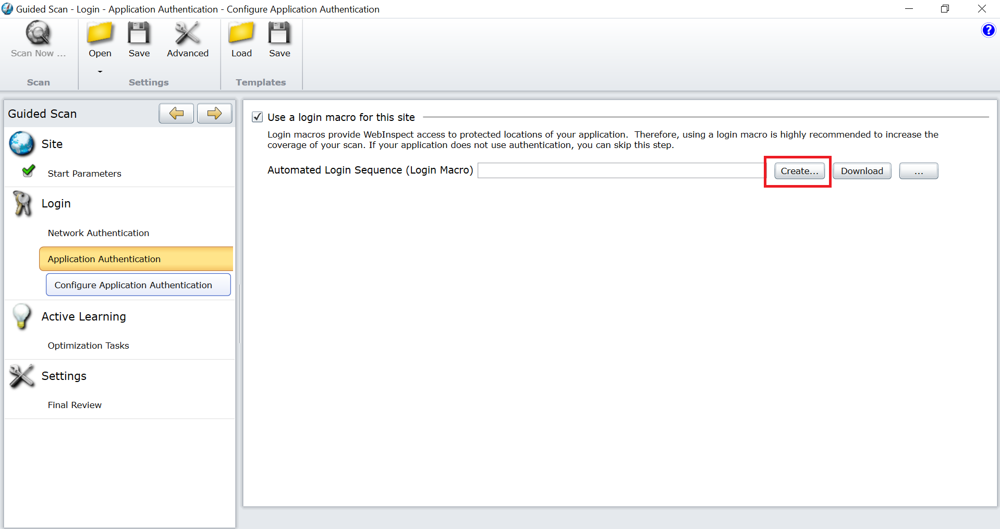
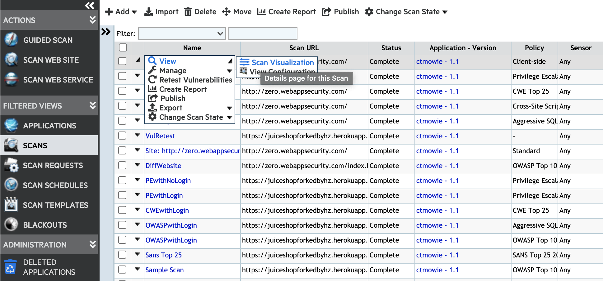
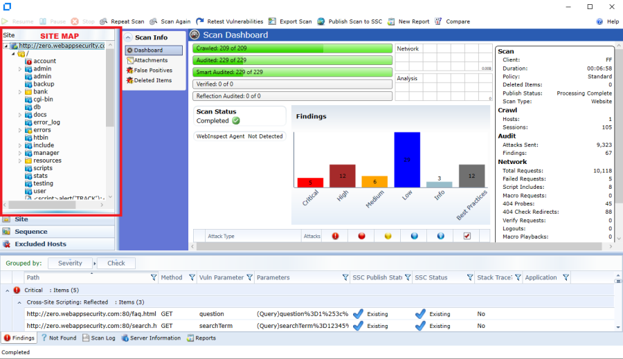
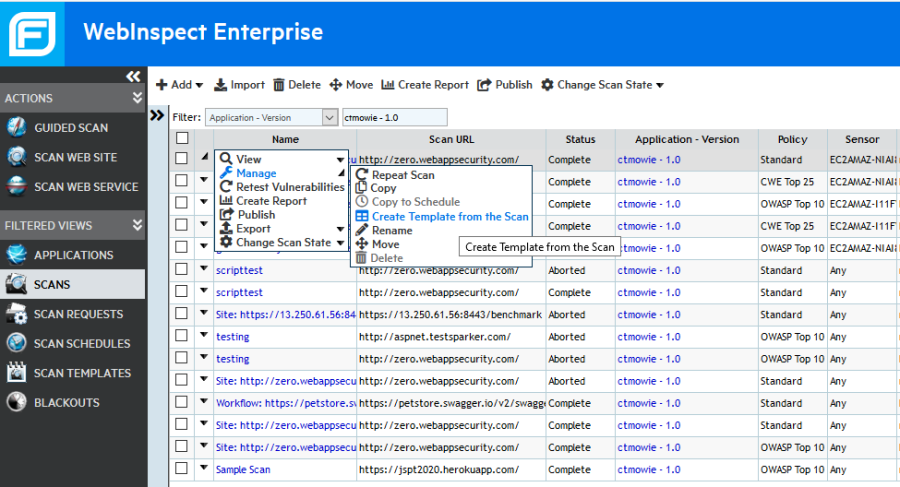
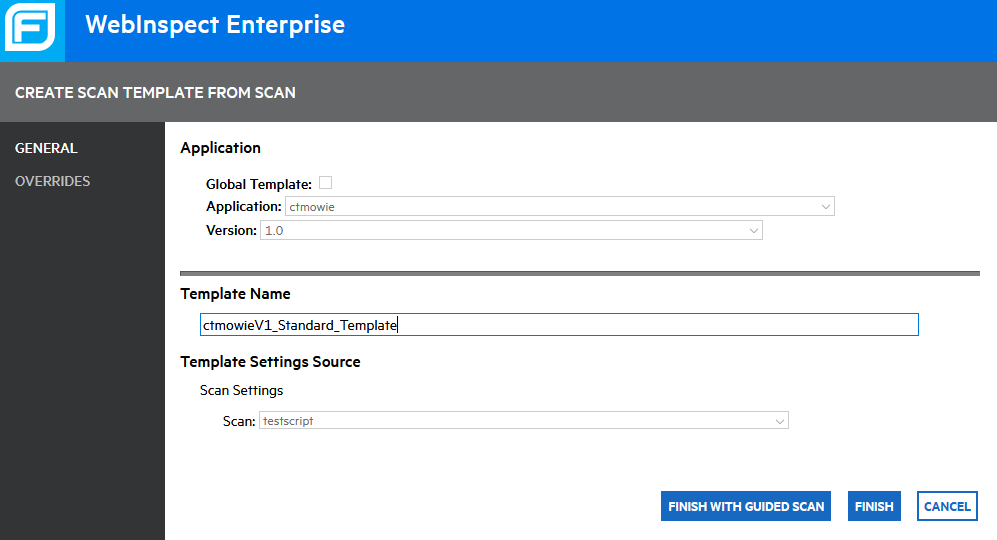
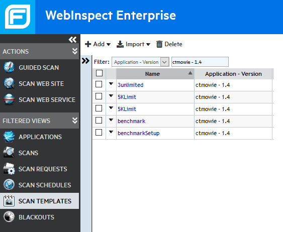
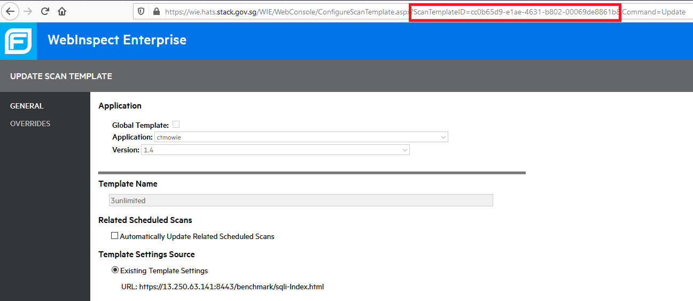

# Scan via Windows App (WIEDesktop.exe)

**Topics**  

- [Prerequisites](#prerequisites)
- [Create a Scan](#create-a-scan)
- [Verify a Scan](#verify-a-scan)
- [Create a Scan Template](#create-a-scan-template)
- [Find Scan Template ID](#find-scan-template-id)
- [Resources](#resources)

## Prerequisites
- Web Application to test must be hosted, running and accessible via Internet. It is highly recommended that a static IP is used.
- The WebInspect Desktop App is installed (available for download from WebInspect Portal, 64-bit Windows only)

    <kbd>

To log in to WIE in the desktop app, use the following details:
- **URL:** https://wie.hats.stack.gov.sg/
- **User Name:** *SHIP_username*
- **Password:** *SHIP_password*

## Create a Scan

### To create a guided scan:
1. Log in to https://wie.hats.stack.gov.sg/.
1. Under **Actions**, click **Guided Scan**. 
    
    It should prompt you to open WIEDesktop.exe (Desktop App).

1. Using the Desktop App, create a new scan using the predefined template for *Create a Thorough Web Site Scan*, and then follow the onscreen instructions.
    - **Scan Type:** Use scan type 'Standard' to crawl and audit the site.
    - **Policy:** This defines the type of checks to be done. For a general purpose scan, its recommended to use the 'Standard' policy ([Choosing a Scan Policy](https://docs.developer.tech.gov.sg/docs/ship-hats-documentation/#/webinspect-scan-via-api?id=choose-a-scan-policy))
    - **Login:** A login macro will be required for applications that require authentication.
    
    The application will guide through the creation of a new login macro using the TruClient software (installed with WIE Desktop).
    
    <kbd>

## Verify a Scan

### To verify a scan:
Check the results of the scan to ensure that it has been configured correctly, i.e, all pages were able to be crawled.

1. Scan results can be accessed via the WebInspect Portal under **Scans** > **View** > **Scan Visualization**.

    <kbd>

1. Examine the site map in the results to ensure that all pages have been crawled. If a login macro is used, you must also verify that authenticated pages were successfully crawled.

    <kbd>

## Create a Scan Template
This is an optional step. You can complete this step for for repeated execution of scans. 

### To create a scan template:
1. On the WebInspect Portal, create a Scan Template based on the completed scan.

    <kbd>

    <kbd>

## Find Scan Template ID
All templates (that are visible to your account) can be accessed via the menu item 'Scan Templates'.

### To find scan template ID:
1. Click **Scan Templates**.

    <kbd>
1. Click the template of interest. The ID will be visible in the URL parameters as shown below.

    <kbd>

    >**Notes:** 
    >- By default, the scan templates are specific to an Application and Application Version. For example, the template in the above image can only be used to create scans for *ctmowie - 1.0*.
    >- To scan a new application version, for example *ctmowie - 1.1*, a new scan template has to be created.

## Resources
- Fortify WebInspect User Guide: https://www.microfocus.com/documentation/fortify-webinspect/2010/WI_Help_20.1.0/index.htm
- All Fortify WebInspect (20.1.0) Documentation: https://www.microfocus.com/documentation/fortify-webinspect/2010/
- All Fortify WebInspect Enterprise (20.1.0) Documentation: https://www.microfocus.com/documentation/fortify-webinspect-enterprise/2010/