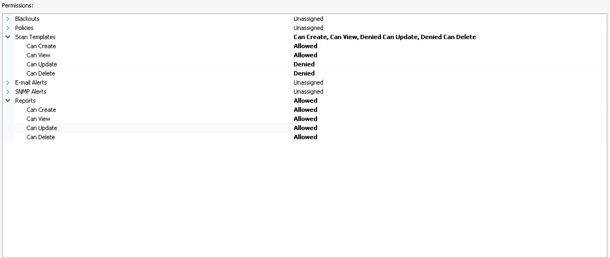

# User Access Control

This page details the different use cases of access control in WIE. For now, we will be creating a standardized user template for all WIE users. Users that possess Fortify SSC roles but not WIE roles are still able to view WIE scan results via the SSC portal.

<!-- tabs:start -->
### **User**

Standard user in WIE, able to perform scans, create reports and other standard tasks within their own group/organization.

Only users that needs to use WIE should be granted this role (We recommend creating service account roles). Other users in SSC that are not granted this role are still able to view scan results via the SSC portal.

Restricted from any administrative user permissions as well as delete actions.

### Group level permissions

<kbd>

### Organization level permissions

<kbd>

### **Admin**
Only HATS administrators are granted this role. Allow the performing of all actions including adding and removing users/projects and scans.	

### **Manager**
On top of having the standard User permissions, Manager has the permission to delete scans and scan templates	

### Group level permissions

<kbd>

<!-- tabs:end -->
